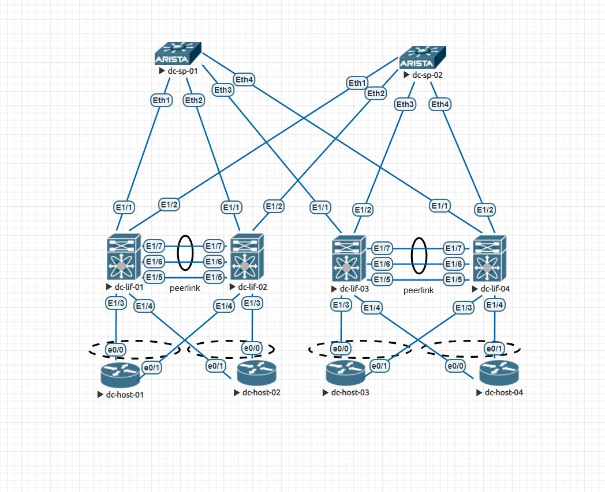

## Топология сети leaf-spine 
В данной сети используются следующие устройства:
- spine - arista 4.27.5
- leaf - n9k 9.3.3
- host - cisco IOL L2

## Краткое описание

- spine/leaf соединяются p2p линками, на каждом устройстве настроены loopback интерфейсы
- leaf между собой используют vpc пару
- leaf/host собираются в port-channel

## IP PLAN

