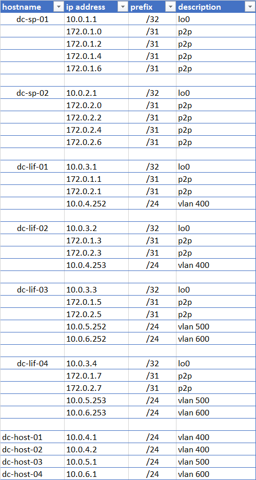

## Цель
Настроить OSPF для Underlay сети

## IP PLAN

## Статус настройки OSPF

<code>**dc-sp-01**# sh ip ospf neighbor 

Neighbor ID     Instance VRF      Pri State                  Dead Time   Address         Interface
3.3.3.1         1        default  1   FULL                   00:00:36    172.0.1.1       Ethernet1
3.3.3.2         1        default  1   FULL                   00:00:36    172.0.1.3       Ethernet2
3.3.3.3         1        default  1   FULL                   00:00:38    172.0.1.5       Ethernet3
3.3.3.4         1        default  1   FULL                   00:00:35    172.0.1.7       Ethernet4
</code>

<code>dc-sp-01#sh ip route ospf

 O        172.0.2.0/31 [110/50] via 172.0.1.1, Ethernet1
 O        172.0.2.2/31 [110/50] via 172.0.1.3, Ethernet2
 O        172.0.2.4/31 [110/50] via 172.0.1.5, Ethernet3
 O        172.0.2.6/31 [110/50] via 172.0.1.7, Ethernet4
</code>

<code>dc-sp-02#sh ip ospf neighbor 
Neighbor ID     Instance VRF      Pri State                  Dead Time   Address         Interface
3.3.3.1         1        default  1   FULL                   00:00:36    172.0.2.1       Ethernet1
3.3.3.2         1        default  1   FULL                   00:00:38    172.0.2.3       Ethernet2
3.3.3.3         1        default  1   FULL                   00:00:34    172.0.2.5       Ethernet3
3.3.3.4         1        default  1   FULL                   00:00:38    172.0.2.7       Ethernet4
</code>

<code>**dc-sp-02**#sh ip route ospf

 O        172.0.1.0/31 [110/50] via 172.0.2.1, Ethernet1
 O        172.0.1.2/31 [110/50] via 172.0.2.3, Ethernet2
 O        172.0.1.4/31 [110/50] via 172.0.2.5, Ethernet3
 O        172.0.1.6/31 [110/50] via 172.0.2.7, Ethernet4
 </code>
 
<code>[spoiler]
dc-sp-01#sh run
! Command: show running-config
! device: dc-sp-01 (vEOS, EOS-4.27.5M)
!
! boot system flash:/EOS.swi
!
no aaa root
!
transceiver qsfp default-mode 4x10G
!
service routing protocols model ribd
!
hostname dc-sp-01
!
spanning-tree mode mstp
!
interface Ethernet1
   mtu 9212
   ip address 172.0.1.0/31
   ip ospf network point-to-point
   ip ospf area 0.0.0.0
!
interface Ethernet2
   mtu 9212
   ip address 172.0.1.2/31
   ip ospf network point-to-point
   ip ospf area 0.0.0.0
!
interface Ethernet3
   mtu 9212
   ip address 172.0.1.4/31
   ip ospf network point-to-point
   ip ospf area 0.0.0.0
!
interface Ethernet4
   mtu 9212
   ip address 172.0.1.6/31
   ip ospf network point-to-point
   ip ospf area 0.0.0.0
!
interface Ethernet5
!
interface Ethernet6
!
interface Ethernet7
!
interface Ethernet8
!
interface Loopback0
   ip address 10.0.1.1/32
!
interface Management1
!
ip routing
!
router ospf 1
   router-id 1.1.1.1
   max-lsa 12000
!
end
[/spoiler]
</code>