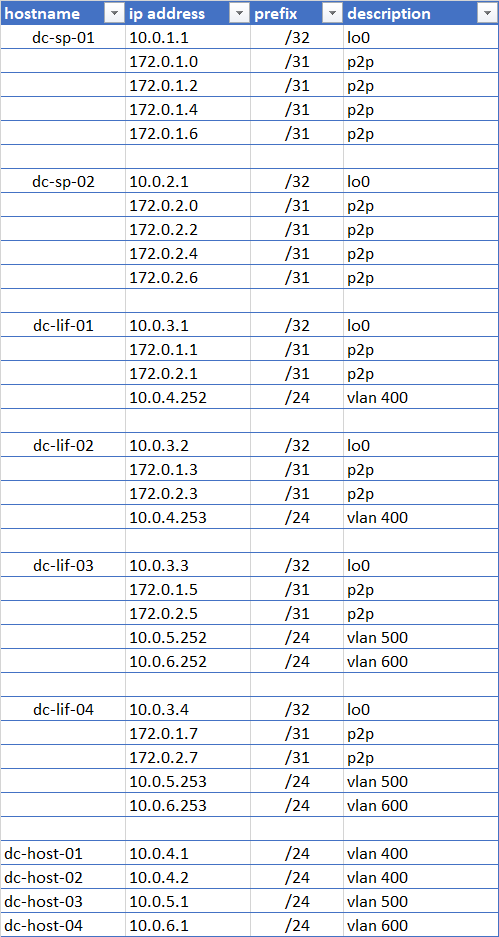

## Цель
Настроить ISIS для Underlay сети

## Схема сети
<details>
<summary>тык</summary>


</details>

## IP PLAN
<details>
<summary>тык</summary>



</details>

## Статус настройки ISIS

**dc-sp-01**# sh isis UNDERLAY neighbors 
```
Instance  VRF      System Id        Type Interface          SNPA              State Hold time   Circuit Id
UNDERLAY  default  dc-lif-01        L2   Ethernet1          P2P               UP    29          01
UNDERLAY  default  dc-lif-02        L2   Ethernet2          P2P               UP    26          01
UNDERLAY  default  dc-lif-03        L2   Ethernet3          P2P               UP    24          01
UNDERLAY  default  dc-lif-04        L2   Ethernet4          P2P               UP    28          01
```

**dc-sp-01**sh ip route isis
```
 I L2     10.0.2.1/32 [115/60]  via 172.0.1.1, Ethernet1
                                via 172.0.1.3, Ethernet2
                                via 172.0.1.5, Ethernet3
                                via 172.0.1.7, Ethernet4
 I L2     10.0.3.1/32 [115/11]  via 172.0.1.1, Ethernet1
 I L2     10.0.3.2/32 [115/11]  via 172.0.1.3, Ethernet2
 I L2     10.0.3.3/32 [115/11]  via 172.0.1.5, Ethernet3
 I L2     10.0.3.4/32 [115/11]  via 172.0.1.7, Ethernet4
 I L2     172.0.2.0/31 [115/50] via 172.0.1.1, Ethernet1
 I L2     172.0.2.2/31 [115/50] via 172.0.1.3, Ethernet2
 I L2     172.0.2.4/31 [115/50] via 172.0.1.5, Ethernet3
 I L2     172.0.2.6/31 [115/50] via 172.0.1.7, Ethernet4
```

**dc-sp-02**#sh isis UNDERLAY neighbors
```
Instance  VRF      System Id        Type Interface          SNPA              State Hold time   Circuit Id
UNDERLAY  default  dc-lif-01        L2   Ethernet1          P2P               UP    28          01
UNDERLAY  default  dc-lif-02        L2   Ethernet2          P2P               UP    28          01
UNDERLAY  default  dc-lif-03        L2   Ethernet3          P2P               UP    27          01
UNDERLAY  default  dc-lif-04        L2   Ethernet4          P2P               UP    30          01
```

**dc-sp-02**#sh ip route isis
```

 I L2     10.0.1.1/32 [115/60]  via 172.0.2.1, Ethernet1
                                via 172.0.2.3, Ethernet2
                                via 172.0.2.5, Ethernet3
                                via 172.0.2.7, Ethernet4
 I L2     10.0.3.1/32 [115/11]  via 172.0.2.1, Ethernet1
 I L2     10.0.3.2/32 [115/11]  via 172.0.2.3, Ethernet2
 I L2     10.0.3.3/32 [115/11]  via 172.0.2.5, Ethernet3
 I L2     10.0.3.4/32 [115/11]  via 172.0.2.7, Ethernet4
 I L2     172.0.1.0/31 [115/50] via 172.0.2.1, Ethernet1
 I L2     172.0.1.2/31 [115/50] via 172.0.2.3, Ethernet2
 I L2     172.0.1.4/31 [115/50] via 172.0.2.5, Ethernet3
 I L2     172.0.1.6/31 [115/50] via 172.0.2.7, Ethernet4
```

**dc-lif-02**# sh isis adjacency
```
System ID       SNPA            Level  State  Hold Time  Interface
dc-sp-01        N/A             2      UP     00:00:28   Ethernet1/1
dc-sp-02        N/A             2      UP     00:00:24   Ethernet1/2
```

**dc-lif-03**# sh isis adjacency
```
System ID       SNPA            Level  State  Hold Time  Interface
dc-sp-01        N/A             2      UP     00:00:28   Ethernet1/1
dc-sp-02        N/A             2      UP     00:00:24   Ethernet1/2
```

## Полный конфиг устройств

<details>
<summary>dc-sp-01</summary>

```
! Command: show running-config
! device: dc-sp-01 (vEOS, EOS-4.25.3M)
!
! boot system flash:/vEOS-lab.swi
!
transceiver qsfp default-mode 4x10G
!
service routing protocols model ribd
!
hostname dc-sp-01
!
spanning-tree mode mstp
!
no aaa root
!
interface Ethernet1
   no switchport
   ip address 172.0.1.0/31
   isis enable UNDERLAY
   isis network point-to-point
!
interface Ethernet2
   no switchport
   ip address 172.0.1.2/31
   isis enable UNDERLAY
   isis network point-to-point
!
interface Ethernet3
   no switchport
   ip address 172.0.1.4/31
   isis enable UNDERLAY
   isis network point-to-point
!
interface Ethernet4
   no switchport
   ip address 172.0.1.6/31
   isis enable UNDERLAY
   isis network point-to-point
!
interface Ethernet5
!
interface Ethernet6
!
interface Ethernet7
!
interface Ethernet8
!
interface Loopback0
   ip address 10.0.1.1/32
   isis enable UNDERLAY
!
interface Management1
!
ip routing
!
ipv6 unicast-routing
!
router isis UNDERLAY
   net 49.0001.0100.0000.1001.00
   is-type level-2
   !
   address-family ipv4 unicast
!
end
```
</details>

<details>
<summary>dc-sp-02</summary>

```
! Command: show running-config
! device: dc-sp-02 (vEOS, EOS-4.25.3M)
!
! boot system flash:/vEOS-lab.swi
!
transceiver qsfp default-mode 4x10G
!
service routing protocols model ribd
!
hostname dc-sp-02
!
spanning-tree mode mstp
!
no aaa root
!
interface Ethernet1
   no switchport
   ip address 172.0.2.0/31
   isis enable UNDERLAY
   isis network point-to-point
!
interface Ethernet2
   no switchport
   ip address 172.0.2.2/31
   isis enable UNDERLAY
   isis network point-to-point
!
interface Ethernet3
   no switchport
   ip address 172.0.2.4/31
   isis enable UNDERLAY
   isis network point-to-point
!
interface Ethernet4
   no switchport
   ip address 172.0.2.6/31
   isis enable UNDERLAY
   isis network point-to-point
!
interface Ethernet5
!
interface Ethernet6
!
interface Ethernet7
!
interface Ethernet8
!
interface Loopback0
   ip address 10.0.2.1/32
   isis enable UNDERLAY
!
interface Management1
!
ip routing
!
router isis UNDERLAY
   net 49.0001.0100.0000.2001.00
   is-type level-2
   !
   address-family ipv4 unicast
!
end

```
</details>

<details>
<summary>dc-lif-01</summary>

```
!Command: show running-config
!Running configuration last done at: Wed Jun 28 22:29:27 2023
!Time: Wed Jun 28 22:29:27 2023

version 9.3(3) Bios:version  
hostname dc-lif-01
vdc dc-lif-01 id 1
  limit-resource vlan minimum 16 maximum 4094
  limit-resource vrf minimum 2 maximum 4096
  limit-resource port-channel minimum 0 maximum 511
  limit-resource u4route-mem minimum 248 maximum 248
  limit-resource u6route-mem minimum 96 maximum 96
  limit-resource m4route-mem minimum 58 maximum 58
  limit-resource m6route-mem minimum 8 maximum 8

cfs eth distribute
feature isis
feature interface-vlan
feature lacp
feature vpc

no password strength-check
username admin password 5 $5$TMpxKPov$Yjw1tbCD70N5kPVD7DeiNsBvjMUG854cRuu9D0uhvY6  role network-admin
ip domain-lookup
copp profile strict
snmp-server user admin network-admin auth md5 0x1efb138d6c1c3484b18ae65ad9714254 priv 0x1efb138d6c1c3484b18ae65ad9714254 localizedkey
rmon event 1 description FATAL(1) owner PMON@FATAL
rmon event 2 description CRITICAL(2) owner PMON@CRITICAL
rmon event 3 description ERROR(3) owner PMON@ERROR
rmon event 4 description WARNING(4) owner PMON@WARNING
rmon event 5 description INFORMATION(5) owner PMON@INFO

vlan 1,400
vlan 400
  name hosts

vrf context VPC_KEEPALIVE
vrf context management
vpc domain 1
  role priority 32000
  peer-keepalive destination 192.168.1.2 source 192.168.1.1 vrf VPC_KEEPALIVE
  peer-gateway

interface Vlan1
  no ip redirects
  no ipv6 redirects

interface Vlan400
  no shutdown
  no ip redirects
  ip address 10.0.4.252/24
  no ipv6 redirects

interface port-channel1
  description VPC_PEERLINK
  switchport mode trunk
  spanning-tree port type network
  vpc peer-link

interface port-channel3
  description dc-host-01
  switchport mode trunk
  switchport trunk allowed vlan 400
  vpc 3

interface port-channel4
  description dc-host-02
  switchport mode trunk
  switchport trunk allowed vlan 400
  vpc 4

interface Ethernet1/1
  description dc-sp-01
  no switchport
  mtu 9212
  ip address 172.0.1.1/31
  no isis hello-padding always
  isis network point-to-point
  ip router isis UNDERLAY
  no shutdown

interface Ethernet1/2
  description dc-sp-02
  no switchport
  mtu 9212
  ip address 172.0.2.1/31
  no isis hello-padding always
  isis network point-to-point
  ip router isis UNDERLAY
  no shutdown

interface Ethernet1/3
  description dc-host-01
  switchport mode trunk
  switchport trunk allowed vlan 400
  channel-group 3 mode active

interface Ethernet1/4
  description dc-host-02
  switchport mode trunk
  switchport trunk allowed vlan 400
  channel-group 4 mode active

interface Ethernet1/5
  description VPC_PEERLINK
  switchport mode trunk
  channel-group 1 mode active

interface Ethernet1/6
  description VPC_PEERLINK
  switchport mode trunk
  channel-group 1 mode active

interface Ethernet1/7
  description VPC_KEEPALIVE
  no switchport
  vrf member VPC_KEEPALIVE
  ip address 192.168.1.1/30
  no shutdown

interface Ethernet1/8

interface Ethernet1/9

interface Ethernet1/10

interface Ethernet1/11

interface Ethernet1/12

interface Ethernet1/13

interface Ethernet1/14

interface Ethernet1/15

interface Ethernet1/16

interface Ethernet1/17

interface Ethernet1/18

interface Ethernet1/19

interface Ethernet1/20

interface Ethernet1/21

interface Ethernet1/22

interface Ethernet1/23

interface Ethernet1/24

interface Ethernet1/25

interface Ethernet1/26

interface Ethernet1/27

interface Ethernet1/28

interface Ethernet1/29

interface Ethernet1/30

interface Ethernet1/31

interface Ethernet1/32

interface Ethernet1/33

interface Ethernet1/34

interface Ethernet1/35

interface Ethernet1/36

interface Ethernet1/37

interface Ethernet1/38

interface Ethernet1/39

interface Ethernet1/40

interface Ethernet1/41

interface Ethernet1/42

interface Ethernet1/43

interface Ethernet1/44

interface Ethernet1/45

interface Ethernet1/46

interface Ethernet1/47

interface Ethernet1/48

interface Ethernet1/49

interface Ethernet1/50

interface Ethernet1/51

interface Ethernet1/52

interface Ethernet1/53

interface Ethernet1/54

interface Ethernet1/55

interface Ethernet1/56

interface Ethernet1/57

interface Ethernet1/58

interface Ethernet1/59

interface Ethernet1/60

interface Ethernet1/61

interface Ethernet1/62

interface Ethernet1/63

interface Ethernet1/64

interface mgmt0
  vrf member management

interface loopback0
  ip address 10.0.3.1/32
  ip router isis UNDERLAY
cli alias name wr copy run start
line console
line vty
boot nxos bootflash:/nxos.9.3.3.bin sup-1
router isis UNDERLAY
  net 49.0001.0100.0000.3001.00
  is-type level-2
  log-adjacency-changes
  address-family ipv4 unicast
```
</details>

<details>
<summary>dc-lif-02</summary>

```
!Command: show running-config
!Running configuration last done at: Wed Jun 28 22:29:03 2023
!Time: Wed Jun 28 22:29:04 2023

version 9.3(3) Bios:version  
hostname dc-lif-02
vdc dc-lif-02 id 1
  limit-resource vlan minimum 16 maximum 4094
  limit-resource vrf minimum 2 maximum 4096
  limit-resource port-channel minimum 0 maximum 511
  limit-resource u4route-mem minimum 248 maximum 248
  limit-resource u6route-mem minimum 96 maximum 96
  limit-resource m4route-mem minimum 58 maximum 58
  limit-resource m6route-mem minimum 8 maximum 8

cfs eth distribute
feature isis
feature interface-vlan
feature lacp
feature vpc

no password strength-check
username admin password 5 $5$m6y68E.I$eyqXDMryy33VPLMLOuW/wkvVZR0L6mUg5UEtg/OnA14  role network-admin
ip domain-lookup
copp profile strict
snmp-server user admin network-admin auth md5 0x60a3f7e75e91abe79f5b1cda2d868589 priv 0x60a3f7e75e91abe79f5b1cda2d868589 localizedkey
rmon event 1 description FATAL(1) owner PMON@FATAL
rmon event 2 description CRITICAL(2) owner PMON@CRITICAL
rmon event 3 description ERROR(3) owner PMON@ERROR
rmon event 4 description WARNING(4) owner PMON@WARNING
rmon event 5 description INFORMATION(5) owner PMON@INFO

vlan 1,400
vlan 400
  name hosts

vrf context VPC_KEEPALIVE
vrf context management
vpc domain 1
  role priority 32000
  peer-keepalive destination 192.168.1.1 source 192.168.1.2 vrf VPC_KEEPALIVE
  peer-gateway

interface Vlan1
  no ip redirects
  no ipv6 redirects

interface Vlan400
  no shutdown
  no ip redirects
  ip address 10.0.4.253/24
  no ipv6 redirects

interface port-channel1
  description PEERLINK
  switchport mode trunk
  spanning-tree port type network
  vpc peer-link

interface port-channel3
  description dc-host-01
  switchport mode trunk
  switchport trunk allowed vlan 400
  vpc 3

interface port-channel4
  description dc-host-02
  switchport mode trunk
  switchport trunk allowed vlan 400
  vpc 4

interface Ethernet1/1
  description dc-sp-01
  no switchport
  mtu 9212
  ip address 172.0.1.3/31
  no isis hello-padding always
  isis network point-to-point
  ip router isis UNDERLAY
  no shutdown

interface Ethernet1/2
  description dc-sp-02
  no switchport
  mtu 9212
  ip address 172.0.2.3/31
  no isis hello-padding always
  isis network point-to-point
  ip router isis UNDERLAY
  no shutdown

interface Ethernet1/3
  description dc-host-01
  switchport mode trunk
  switchport trunk allowed vlan 400
  channel-group 3 mode active

interface Ethernet1/4
  description dc-host-02
  switchport mode trunk
  switchport trunk allowed vlan 400
  channel-group 4 mode active

interface Ethernet1/5
  description VPC_PEERLINK
  switchport mode trunk
  channel-group 1 mode active

interface Ethernet1/6
  description VPC_PEERLINK
  switchport mode trunk
  channel-group 1 mode active

interface Ethernet1/7
  description VPC_KEEPALIVE
  no switchport
  vrf member VPC_KEEPALIVE
  ip address 192.168.1.2/30
  no shutdown

interface Ethernet1/8

interface Ethernet1/9

interface Ethernet1/10

interface Ethernet1/11

interface Ethernet1/12

interface Ethernet1/13

interface Ethernet1/14

interface Ethernet1/15

interface Ethernet1/16

interface Ethernet1/17

interface Ethernet1/18

interface Ethernet1/19

interface Ethernet1/20

interface Ethernet1/21

interface Ethernet1/22

interface Ethernet1/23

interface Ethernet1/24

interface Ethernet1/25

interface Ethernet1/26

interface Ethernet1/27

interface Ethernet1/28

interface Ethernet1/29

interface Ethernet1/30

interface Ethernet1/31

interface Ethernet1/32

interface Ethernet1/33

interface Ethernet1/34

interface Ethernet1/35

interface Ethernet1/36

interface Ethernet1/37

interface Ethernet1/38

interface Ethernet1/39

interface Ethernet1/40

interface Ethernet1/41

interface Ethernet1/42

interface Ethernet1/43

interface Ethernet1/44

interface Ethernet1/45

interface Ethernet1/46

interface Ethernet1/47

interface Ethernet1/48

interface Ethernet1/49

interface Ethernet1/50

interface Ethernet1/51

interface Ethernet1/52

interface Ethernet1/53

interface Ethernet1/54

interface Ethernet1/55

interface Ethernet1/56

interface Ethernet1/57

interface Ethernet1/58

interface Ethernet1/59

interface Ethernet1/60

interface Ethernet1/61

interface Ethernet1/62

interface Ethernet1/63

interface Ethernet1/64

interface mgmt0
  vrf member management

interface loopback0
  ip address 10.0.3.2/32
  ip router isis UNDERLAY
cli alias name wr copy run start
line console
line vty
boot nxos bootflash:/nxos.9.3.3.bin sup-1
router isis UNDERLAY
  net 49.0001.0100.0000.3002.00
  is-type level-2
  log-adjacency-changes
  address-family ipv4 unicast


!


!end

```
</details>

<details>
<summary>dc-lif-03</summary>

```
!Command: show running-config
!No configuration change since last restart
!Time: Thu Jun 29 10:59:23 2023

version 9.3(3) Bios:version
hostname dc-lif-03
vdc dc-lif-03 id 1
  limit-resource vlan minimum 16 maximum 4094
  limit-resource vrf minimum 2 maximum 4096
  limit-resource port-channel minimum 0 maximum 511
  limit-resource u4route-mem minimum 248 maximum 248
  limit-resource u6route-mem minimum 96 maximum 96
  limit-resource m4route-mem minimum 58 maximum 58
  limit-resource m6route-mem minimum 8 maximum 8

cfs eth distribute
feature isis
feature interface-vlan
feature lacp
feature vpc

no password strength-check
username admin password 5 $5$JnB9fBK9$FaSH3uKTCxVP4K61a5Bme2oEnjQvS9N5nNxidr4zn0
/  role network-admin
ip domain-lookup
copp profile strict
snmp-server user admin network-admin auth md5 0x3b86d5026b721e5a3320611e1a301714
 priv 0x3b86d5026b721e5a3320611e1a301714 localizedkey
rmon event 1 description FATAL(1) owner PMON@FATAL
rmon event 2 description CRITICAL(2) owner PMON@CRITICAL
rmon event 3 description ERROR(3) owner PMON@ERROR
rmon event 4 description WARNING(4) owner PMON@WARNING
rmon event 5 description INFORMATION(5) owner PMON@INFO

vlan 1,500,600

vrf context VPC_KEEPALIVE
vrf context management
vpc domain 1
  role priority 32000
  peer-keepalive destination 192.168.1.2 source 192.168.1.1 vrf VPC_KEEPALIVE
  peer-gateway

interface Vlan1
  no ip redirects
  no ipv6 redirects

interface Vlan500
  no shutdown
  no ip redirects
  ip address 10.0.5.252/24
  no ipv6 redirects

interface Vlan600
  no shutdown
  no ip redirects
  ip address 10.0.6.252/24
  no ipv6 redirects

interface port-channel1
  description VPC_PEERLINK
  switchport mode trunk
  spanning-tree port type network
  vpc peer-link

interface port-channel3
  description dc-host-03
  switchport mode trunk
  switchport trunk allowed vlan 500
  vpc 3

interface port-channel4
  description dc-host-04
  switchport mode trunk
  switchport trunk allowed vlan 600
  vpc 4

interface Ethernet1/1
  no switchport
  mtu 9212
  ip address 172.0.1.5/31
  no isis hello-padding always
  isis network point-to-point
  ip router isis UNDERLAY
  no shutdown

interface Ethernet1/2
  no switchport
  mtu 9212
  ip address 172.0.2.5/31
  no isis hello-padding always
  isis network point-to-point
  ip router isis UNDERLAY
  no shutdown

interface Ethernet1/3
  description dc-host-03
  switchport mode trunk
  switchport trunk allowed vlan 500
  channel-group 3 mode active

interface Ethernet1/4
  description dc-host-04
  switchport mode trunk
  switchport trunk allowed vlan 600
  channel-group 4 mode active

interface Ethernet1/5
  description VPC_PEERLINK
  switchport mode trunk
  channel-group 1 mode active

interface Ethernet1/6
  description VPC_PEERLINK
  switchport mode trunk
  channel-group 1 mode active

interface Ethernet1/7
  description VPC_KEEPALIVE
  no switchport
  vrf member VPC_KEEPALIVE
  ip address 192.168.1.1/30
  no shutdown

interface Ethernet1/8

interface Ethernet1/9

interface Ethernet1/10

interface Ethernet1/11

interface Ethernet1/12

interface Ethernet1/13

interface Ethernet1/14

interface Ethernet1/15

interface Ethernet1/16

interface Ethernet1/17

interface Ethernet1/18

interface Ethernet1/19

interface Ethernet1/20

interface Ethernet1/21

interface Ethernet1/22

interface Ethernet1/23

interface Ethernet1/24

interface Ethernet1/25

interface Ethernet1/26

interface Ethernet1/27

interface Ethernet1/28

interface Ethernet1/29

interface Ethernet1/30

interface Ethernet1/31

interface Ethernet1/32

interface Ethernet1/33

interface Ethernet1/34

interface Ethernet1/35

interface Ethernet1/36

interface Ethernet1/37

interface Ethernet1/38

interface Ethernet1/39

interface Ethernet1/40

interface Ethernet1/41

interface Ethernet1/42

interface Ethernet1/43

interface Ethernet1/44

interface Ethernet1/45

interface Ethernet1/46

interface Ethernet1/47

interface Ethernet1/48

interface Ethernet1/49

interface Ethernet1/50

interface Ethernet1/51

interface Ethernet1/52

interface Ethernet1/53

interface Ethernet1/54

interface Ethernet1/55

interface Ethernet1/56

interface Ethernet1/57

interface Ethernet1/58

interface Ethernet1/59

interface Ethernet1/60

interface Ethernet1/61

interface Ethernet1/62

interface Ethernet1/63

interface Ethernet1/64

interface mgmt0
  vrf member management

interface loopback0
  ip address 10.0.3.3/32
  ip router isis UNDERLAY
cli alias name wr copy run start
line console
line vty
boot nxos bootflash:/nxos.9.3.3.bin sup-1
router isis UNDERLAY
  net 49.0001.0100.0000.3003.00
  is-type level-2
  address-family ipv4 unicast
```
</details>

<details>
<summary>dc-lif-04</summary>

```
!Command: show running-config
!Running configuration last done at: Wed Jun 28 22:31:02 2023
!Time: Thu Jun 29 10:58:43 2023

version 9.3(3) Bios:version
hostname dc-lif-04
vdc dc-lif-04 id 1
  limit-resource vlan minimum 16 maximum 4094
  limit-resource vrf minimum 2 maximum 4096
  limit-resource port-channel minimum 0 maximum 511
  limit-resource u4route-mem minimum 248 maximum 248
  limit-resource u6route-mem minimum 96 maximum 96
  limit-resource m4route-mem minimum 58 maximum 58
  limit-resource m6route-mem minimum 8 maximum 8

cfs eth distribute
feature isis
feature interface-vlan
feature lacp
feature vpc

no password strength-check
username admin password 5 $5$.ppbON1x$d0hLoV4W2EBVeFNdRlwKurc/l4e2pMBpp/3wAPlrBq3  role network-admin
ip domain-lookup
copp profile strict
snmp-server user admin network-admin auth md5 0x660cd9299fbb5cac178a7497b19cbe94 priv 0x660cd9299fbb5cac178a7497b19cbe94 localizedkey
rmon event 1 description FATAL(1) owner PMON@FATAL
rmon event 2 description CRITICAL(2) owner PMON@CRITICAL
rmon event 3 description ERROR(3) owner PMON@ERROR
rmon event 4 description WARNING(4) owner PMON@WARNING
rmon event 5 description INFORMATION(5) owner PMON@INFO

vlan 1,500,600

vrf context VPC_KEEPALIVE
vrf context management
vpc domain 1
  role priority 32000
  peer-keepalive destination 192.168.1.1 source 192.168.1.2 vrf VPC_KEEPALIVE
  peer-gateway

interface Vlan1
  no ip redirects
  no ipv6 redirects

interface Vlan500
  no shutdown
  no ip redirects
  ip address 10.0.5.253/24
  no ipv6 redirects

interface Vlan600
  no shutdown
  no ip redirects
  ip address 10.0.6.253/24
  no ipv6 redirects

interface port-channel1
  description VPC_PEERLINK
  switchport mode trunk
  spanning-tree port type network
  vpc peer-link

interface port-channel3
  description dc-host-03
  switchport mode trunk
  switchport trunk allowed vlan 500
  vpc 3

interface port-channel4
  description dc-host-04
  switchport mode trunk
  switchport trunk allowed vlan 600
  vpc 4

interface Ethernet1/1
  description dc-sp-01
  no switchport
  mtu 9212
  ip address 172.0.1.7/31
  no isis hello-padding always
  isis network point-to-point
  ip router isis UNDERLAY
  no shutdown

interface Ethernet1/2
  description dc-sp-02
  no switchport
  mtu 9212
  ip address 172.0.2.7/31
  no isis hello-padding always
  isis network point-to-point
  ip router isis UNDERLAY
  no shutdown

interface Ethernet1/3
  description dc-host-03
  switchport mode trunk
  switchport trunk allowed vlan 500
  channel-group 3 mode active

interface Ethernet1/4
  description dc-host-04
  switchport mode trunk
  switchport trunk allowed vlan 600
  channel-group 4 mode active

interface Ethernet1/5
  description VPC_PEERLINK
  switchport mode trunk
  channel-group 1 mode active

interface Ethernet1/6
  description VPC_PEERLINK
  switchport mode trunk
  channel-group 1 mode active

interface Ethernet1/7
  description VPC_KEEPALIVE
  no switchport
  vrf member VPC_KEEPALIVE
  ip address 192.168.1.2/30
  no shutdown

interface Ethernet1/8

interface Ethernet1/9

interface Ethernet1/10

interface Ethernet1/11

interface Ethernet1/12

interface Ethernet1/13

interface Ethernet1/14

interface Ethernet1/15

interface Ethernet1/16

interface Ethernet1/17

interface Ethernet1/18

interface Ethernet1/19

interface Ethernet1/20

interface Ethernet1/21

interface Ethernet1/22

interface Ethernet1/23

interface Ethernet1/24

interface Ethernet1/25

interface Ethernet1/26

interface Ethernet1/27

interface Ethernet1/28

interface Ethernet1/29

interface Ethernet1/30

interface Ethernet1/31

interface Ethernet1/32

interface Ethernet1/33

interface Ethernet1/34

interface Ethernet1/35

interface Ethernet1/36

interface Ethernet1/37

interface Ethernet1/38

interface Ethernet1/39

interface Ethernet1/40

interface Ethernet1/41

interface Ethernet1/42

interface Ethernet1/43

interface Ethernet1/44

interface Ethernet1/45

interface Ethernet1/46

interface Ethernet1/47

interface Ethernet1/48

interface Ethernet1/49

interface Ethernet1/50

interface Ethernet1/51

interface Ethernet1/52

interface Ethernet1/53

interface Ethernet1/54

interface Ethernet1/55

interface Ethernet1/56

interface Ethernet1/57

interface Ethernet1/58

interface Ethernet1/59

interface Ethernet1/60

interface Ethernet1/61

interface Ethernet1/62

interface Ethernet1/63

interface Ethernet1/64

interface mgmt0
  vrf member management

interface loopback0
  ip address 10.0.3.4/32
  ip router isis UNDERLAY
cli alias name wr copy run start
line console
line vty
boot nxos bootflash:/nxos.9.3.3.bin sup-1
router isis UNDERLAY
  net 49.0001.0100.0000.3004.00
  is-type level-2
  log-adjacency-changes
  address-family ipv4 unicast

no logging console

```
</details>

<details>
<summary>dc-host-01</summary>

```
dc-host-01#sh run 
Building configuration...

Current configuration : 1219 bytes
!
! Last configuration change at 13:01:06 UTC Wed May 31 2023
!
version 15.2
service timestamps debug datetime msec
service timestamps log datetime msec
no service password-encryption
service compress-config
!
hostname dc-host-01
!
boot-start-marker
boot-end-marker
!
!
!
no aaa new-model
!
!
!
!
!         
!
!
!
ip cef
no ipv6 cef
!
!
!
spanning-tree mode pvst
spanning-tree extend system-id
!
!
! 
!
!
!
!
!
!
!
!
!
!         
!
!
interface Port-channel1
 switchport trunk allowed vlan 400
 switchport trunk encapsulation dot1q
 switchport mode trunk
!
interface Ethernet0/0
 switchport trunk allowed vlan 400
 switchport trunk encapsulation dot1q
 switchport mode trunk
 channel-group 1 mode active
!
interface Ethernet0/1
 switchport trunk allowed vlan 400
 switchport trunk encapsulation dot1q
 switchport mode trunk
 channel-group 1 mode active
!
interface Ethernet0/2
!
interface Ethernet0/3
!         
interface Vlan400
 ip address 10.0.4.1 255.255.255.0
!
ip forward-protocol nd
!
ip http server
!
ip ssh server algorithm encryption aes128-ctr aes192-ctr aes256-ctr
ip ssh client algorithm encryption aes128-ctr aes192-ctr aes256-ctr
!
!
!
!
!
control-plane
!
!
line con 0
 logging synchronous
line aux 0
line vty 0 4
 login
!         
!
!
end
```
</details>

<details>
<summary>dc-host-02</summary>

```
dc-host-02#sh run
Building configuration...

Current configuration : 1212 bytes
!
! Last configuration change at 13:20:29 UTC Wed May 31 2023
!
version 15.2
service timestamps debug datetime msec
service timestamps log datetime msec
no service password-encryption
service compress-config
!
hostname dc-host-02
!
boot-start-marker
boot-end-marker
!
!
!
no aaa new-model
!
!
!
!
!         
!
!
!
ip cef
no ipv6 cef
!
!
!
spanning-tree mode pvst
spanning-tree extend system-id
!
!
! 
!
!
!
!
!
!
!
!
!
!         
!
!
interface Port-channel1
 switchport trunk allowed vlan 400
 switchport trunk encapsulation dot1q
 switchport mode trunk
!
interface Ethernet0/0
 switchport trunk allowed vlan 400
 switchport trunk encapsulation dot1q
 switchport mode trunk
 channel-group 1 mode active
!
interface Ethernet0/1
 switchport trunk allowed vlan 400
 switchport trunk encapsulation dot1q
 switchport mode trunk
 channel-group 1 mode active
!
interface Ethernet0/2
!
interface Ethernet0/3
!         
interface Vlan400
 ip address 10.0.4.2 255.255.255.0
!
ip forward-protocol nd
!
ip http server
!
ip ssh server algorithm encryption aes128-ctr aes192-ctr aes256-ctr
ip ssh client algorithm encryption aes128-ctr aes192-ctr aes256-ctr
!
!
!
!
!
control-plane
!
!
line con 0
 logging synchronous
line aux 0
line vty 0 4
!
!         
!
end
```

</details>

<details>
<summary>dc-host-03</summary>

```
dc-host-03#sh run
Building configuration...

Current configuration : 1264 bytes
!
! Last configuration change at 13:31:13 UTC Wed May 31 2023
!
version 15.2
service timestamps debug datetime msec
service timestamps log datetime msec
no service password-encryption
service compress-config
!
hostname dc-host-03
!
boot-start-marker
boot-end-marker
!
!
!
no aaa new-model
!
!
!
!
!         
!         
!         
!
ip cef
no ipv6 cef
!
!
!
spanning-tree mode pvst
spanning-tree extend system-id
!
!
! 
!
!
!
!
!
!
!
!
!
!
!
!         
interface Port-channel1
 switchport trunk allowed vlan 500
 switchport trunk encapsulation dot1q
 switchport mode trunk
!
interface Ethernet0/0
 switchport trunk allowed vlan 500
 switchport trunk encapsulation dot1q
 switchport mode trunk
 channel-group 1 mode active
!
interface Ethernet0/1
 switchport trunk allowed vlan 500
 switchport trunk encapsulation dot1q
 switchport mode trunk
 channel-group 1 mode active
!
interface Ethernet0/2
 shutdown
!
interface Ethernet0/3
 shutdown
!         
interface Vlan500
 ip address 10.0.5.1 255.255.255.0
!
ip forward-protocol nd
!
no ip http server
!
ip ssh server algorithm encryption aes128-ctr aes192-ctr aes256-ctr
ip ssh client algorithm encryption aes128-ctr aes192-ctr aes256-ctr
!
!
!
!
!
control-plane
!
!
line con 0
 logging synchronous
line aux 0
line vty 0 4
 login
 transport input none
!
!
!
end

```

</details>

<details>
<summary>dc-host-04</summary>


```
dc-host-04#sh run
Building configuration...

Current configuration : 1264 bytes
!
! Last configuration change at 13:38:18 UTC Wed May 31 2023
!
version 15.2
service timestamps debug datetime msec
service timestamps log datetime msec
no service password-encryption
service compress-config
!
hostname dc-host-04
!
boot-start-marker
boot-end-marker
!
!
!
no aaa new-model
!
!
!
!
!         
!
!
!
ip cef
no ipv6 cef
!
!
!
spanning-tree mode pvst
spanning-tree extend system-id
!
!
! 
!
!
!
!
!
!
!
!
!
!         
!
!
interface Port-channel1
 switchport trunk allowed vlan 600
 switchport trunk encapsulation dot1q
 switchport mode trunk
!
interface Ethernet0/0
 switchport trunk allowed vlan 600
 switchport trunk encapsulation dot1q
 switchport mode trunk
 channel-group 1 mode active
!
interface Ethernet0/1
 switchport trunk allowed vlan 600
 switchport trunk encapsulation dot1q
 switchport mode trunk
 channel-group 1 mode active
!
interface Ethernet0/2
 shutdown
!
interface Ethernet0/3
 shutdown
!
interface Vlan600
 ip address 10.0.6.1 255.255.255.0
!
ip forward-protocol nd
!
no ip http server
!
ip ssh server algorithm encryption aes128-ctr aes192-ctr aes256-ctr
ip ssh client algorithm encryption aes128-ctr aes192-ctr aes256-ctr
!
!
!
!
!
control-plane
!
!
line con 0
 logging synchronous
line aux 0
line vty 0 4
 login
 transport input none
!
!
!
end

```

</details>