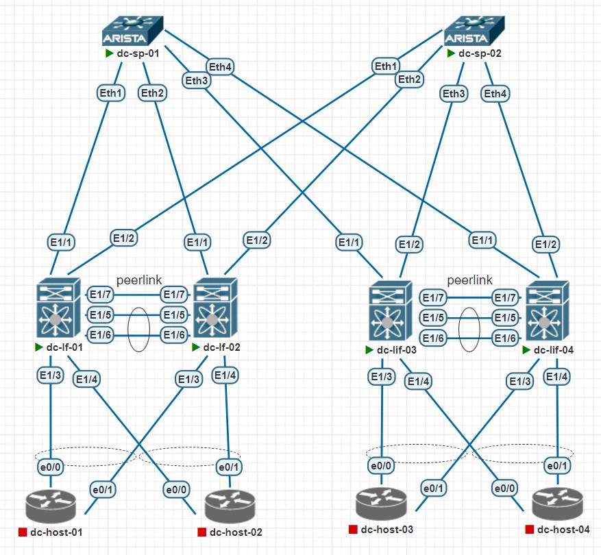
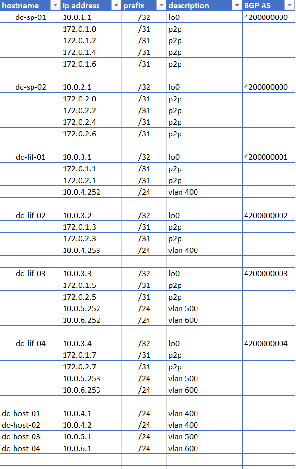

## Цель
- Настроить BGP для Underlay сети
- Согласно ip плану, проанонсировать loopback сети
- На leaf настроить ecmp балансировку

## Схема сети
<details>
<summary>тык</summary>



</details>

## IP PLAN
<details>
<summary>тык</summary>



</details>

## SPEANE 01/02
## Статус BGP пирнга с leaf 

**dc-sp-01**# sh ip bgp summary
```
Neighbor         V  AS           MsgRcvd   MsgSent  InQ OutQ  Up/Down State   PfxRcd PfxAcc
172.0.1.1        4  4200000001        81        84    0    0 00:06:20 Estab   1      1
172.0.1.3        4  4200000002       427       441    0    0 00:35:29 Estab   1      1
172.0.1.5        4  4200000003        56        59    0    0 00:04:18 Estab   1      1
172.0.1.7        4  4200000004       286       294    0    0 00:23:32 Estab   1      1
```

**dc-sp-02**# sh ip bgp summary
```
Neighbor         V  AS           MsgRcvd   MsgSent  InQ OutQ  Up/Down State   PfxRcd PfxAcc
172.0.2.1        4  4200000001        39        43    0    0 00:02:55 Estab   1      1
172.0.2.3        4  4200000002        38        42    0    0 00:02:51 Estab   1      1
172.0.2.5        4  4200000003        36        40    0    0 00:02:41 Estab   1      1
172.0.2.7        4  4200000004        28        32    0    0 00:02:01 Estab   1      1
```

## Сети в BGP таблице на SPINE 

**dc-sp-01** sh ip bgp
```
        Network                Next Hop            Metric  LocPref Weight  Path
* >     10.0.1.1/32            -                     0       0       -       i
* >     10.0.3.1/32            172.0.1.1             0       100     0       4200000001 i
* >     10.0.3.2/32            172.0.1.3             0       100     0       4200000002 i
* >     10.0.3.3/32            172.0.1.5             0       100     0       4200000003 i
* >     10.0.3.4/32            172.0.1.7             0       100     0       4200000004 i
```

**dc-sp-02** sh ip bgp
```
        Network                Next Hop            Metric  LocPref Weight  Path
* >     10.0.2.1/32            -                     0       0       -       i
* >     10.0.3.1/32            172.0.2.1             0       100     0       4200000001 i
* >     10.0.3.2/32            172.0.2.3             0       100     0       4200000002 i
* >     10.0.3.3/32            172.0.2.5             0       100     0       4200000003 i
* >     10.0.3.4/32            172.0.2.7             0       100     0       4200000004 i
```

## Сети в таблице маршрутизации на SPINE 
**dc-sp-01** sh ip route
```
C        10.0.1.1/32 is directly connected, Loopback0
B E      10.0.3.1/32 [200/0] via 172.0.1.1, Ethernet1
B E      10.0.3.2/32 [200/0] via 172.0.1.3, Ethernet2
B E      10.0.3.3/32 [200/0] via 172.0.1.5, Ethernet3
B E      10.0.3.4/32 [200/0] via 172.0.1.7, Ethernet4
C        172.0.1.0/31 is directly connected, Ethernet1
C        172.0.1.2/31 is directly connected, Ethernet2
C        172.0.1.4/31 is directly connected, Ethernet3
C        172.0.1.6/31 is directly connected, Ethernet4
```

**dc-sp-02**# sh ip route
```
C        10.0.2.1/32 is directly connected, Loopback0
B E      10.0.3.1/32 [200/0] via 172.0.2.1, Ethernet1
B E      10.0.3.2/32 [200/0] via 172.0.2.3, Ethernet2
B E      10.0.3.3/32 [200/0] via 172.0.2.5, Ethernet3
B E      10.0.3.4/32 [200/0] via 172.0.2.7, Ethernet4
C        172.0.2.0/31 is directly connected, Ethernet1
C        172.0.2.2/31 is directly connected, Ethernet2
C        172.0.2.4/31 is directly connected, Ethernet3
C        172.0.2.6/31 is directly connected, Ethernet4
```

## LEAF 01/02/03/04
## Статус BGP пирнга с SPINE

**dc-lf-01**# sh ip bgp summary
```
Neighbor        V    AS      MsgRcvd MsgSent   TblVer  InQ OutQ Up/Down  State/PfxRcd
172.0.1.0       4 4200000000 388     384       19      0    0   00:31:43     4                        
172.0.2.0       4 4200000000 277     269       19      0    0   00:16:30     4
                            
```

**dc-lf-02**# sh ip bgp summary
```
Neighbor        V    AS      MsgRcvd MsgSent   TblVer  InQ OutQ Up/Down  State/PfxRcd
172.0.1.2       4 4200000000 1440    1421       79     0    0   00:00:09     4               
172.0.2.2       4 4200000000 1014     998       79     0    0   00:28:43     4      
                                      
```

**dc-lf-03**# sh ip bgp summary
```
Neighbor        V    AS      MsgRcvd MsgSent   TblVer  InQ OutQ Up/Down  State/PfxRcd
172.0.1.4       4 4200000000 25      21        14      0    0   00:01:29    4                         
172.0.2.4       4 4200000000 236     228       14      0    0   00:18:51    4
                                                       
```
**dc-lf-04**# sh ip bgp summary
```
Neighbor        V    AS       MsgRcvd MsgSent   TblVer  InQ OutQ Up/Down  State/PfxRcd
172.0.1.6       4 4200000000  659     649       25      0    0   00:53:58    4                        
172.0.2.6       4 4200000000  537     524       25      0    0   00:20:40    4
                                                        
```

## Сети в BGP таблице на LEAF

**dc-lf-01** sh ip bgp
```
BGP routing table information for VRF default, address family IPv4 Unicast
BGP table version is 41, Local Router ID is 10.0.3.1
Status: s-suppressed, x-deleted, S-stale, d-dampened, h-history, *-valid, >-best
Path type: i-internal, e-external, c-confed, l-local, a-aggregate, r-redist, I-i
njected
Origin codes: i - IGP, e - EGP, ? - incomplete, | - multipath, & - backup, 2 - b
est2

   Network            Next Hop            Metric     LocPrf     Weight Path
*>e10.0.1.1/32        172.0.1.0                                      0 4200000000 i
*>e10.0.2.1/32        172.0.2.0                                      0 4200000000 i
*>l10.0.3.1/32        0.0.0.0                           100      32768 i
*|e10.0.3.2/32        172.0.1.0                                      0 4200000000 4200000002 i
*>e                   172.0.2.0                                      0 4200000000 4200000002 i
*|e10.0.3.3/32        172.0.1.0                                      0 4200000000 4200000003 i
*>e                   172.0.2.0                                      0 4200000000 4200000003 i
*|e10.0.3.4/32        172.0.1.0                                      0 4200000000 4200000004 i
*>e                   172.0.2.0                                      0 4200000000 4200000004 i
```

**dc-lf-02** sh ip bgp
```
BGP routing table information for VRF default, address family IPv4 Unicast
BGP table version is 41, Local Router ID is 10.0.3.1
Status: s-suppressed, x-deleted, S-stale, d-dampened, h-history, *-valid, >-best
Path type: i-internal, e-external, c-confed, l-local, a-aggregate, r-redist, I-i
njected
Origin codes: i - IGP, e - EGP, ? - incomplete, | - multipath, & - backup, 2 - b
est2

   Network            Next Hop            Metric     LocPrf     Weight Path
*>e10.0.1.1/32        172.0.1.2                                      0 4200000000 i
*>e10.0.2.1/32        172.0.2.2                                      0 4200000000 i
*|e10.0.3.1/32        172.0.1.2                                      0 4200000000 4200000001 i
*>e                   172.0.2.2                                      0 4200000000 4200000001 i
*>l10.0.3.2/32        0.0.0.0                           100      32768 i
*|e10.0.3.3/32        172.0.1.2                                      0 4200000000 4200000003 i
*>e                   172.0.2.2                                      0 4200000000 4200000003 i
*|e10.0.3.4/32        172.0.1.2                                      0 4200000000 4200000004 i
*>e                   172.0.2.2                                      0 4200000000 4200000004 i
```

**dc-lf-03** sh ip bgp
```
BGP routing table information for VRF default, address family IPv4 Unicast
BGP table version is 41, Local Router ID is 10.0.3.1
Status: s-suppressed, x-deleted, S-stale, d-dampened, h-history, *-valid, >-best
Path type: i-internal, e-external, c-confed, l-local, a-aggregate, r-redist, I-i
njected
Origin codes: i - IGP, e - EGP, ? - incomplete, | - multipath, & - backup, 2 - b
est2

   Network            Next Hop            Metric     LocPrf     Weight Path
*>e10.0.1.1/32        172.0.1.4                                      0 4200000000 i
*>e10.0.2.1/32        172.0.2.4                                      0 4200000000 i
*|e10.0.3.1/32        172.0.1.4                                      0 4200000000 4200000001 i
*>e                   172.0.2.4                                      0 4200000000 4200000001 i
*|e10.0.3.2/32        172.0.1.4                                      0 4200000000 4200000002 i
*>e                   172.0.2.4                                      0 4200000000 4200000002 i
*>l10.0.3.3/32        0.0.0.0                           100      32768 i
*|e10.0.3.4/32        172.0.1.4                                      0 4200000000 4200000004 i
*>e                   172.0.2.4                                      0 4200000000 4200000004 i

```
**dc-lf-04** sh ip bgp
```
BGP routing table information for VRF default, address family IPv4 Unicast
BGP table version is 41, Local Router ID is 10.0.3.1
Status: s-suppressed, x-deleted, S-stale, d-dampened, h-history, *-valid, >-best
Path type: i-internal, e-external, c-confed, l-local, a-aggregate, r-redist, I-i
njected
Origin codes: i - IGP, e - EGP, ? - incomplete, | - multipath, & - backup, 2 - b
est2

   Network            Next Hop            Metric     LocPrf     Weight Path
*>e10.0.1.1/32        172.0.1.6                                      0 4200000000 i
*>e10.0.2.1/32        172.0.2.6                                      0 4200000000 i
*|e10.0.3.1/32        172.0.1.6                                      0 4200000000 4200000001 i
*>e                   172.0.2.6                                      0 4200000000 4200000001 i
*|e10.0.3.2/32        172.0.1.6                                      0 4200000000 4200000002 i
*>e                   172.0.2.6                                      0 4200000000 4200000002 i
*|e10.0.3.3/32        172.0.1.6                                      0 4200000000 4200000003 i
*>e                   172.0.2.6                                      0 4200000000 4200000003 i
*>l10.0.3.4/32        0.0.0.0                           100      32768 i
```

## Сети в таблице маршрутизации на LEAF

**dc-lf-01**# sh ip route bgp
```
10.0.1.1/32, ubest/mbest: 1/0
    *via 172.0.1.0, [20/0], 00:04:45, bgp-4200000001, external, tag 4200000000
10.0.2.1/32, ubest/mbest: 1/0
    *via 172.0.2.0, [20/0], 00:31:37, bgp-4200000001, external, tag 4200000000
10.0.3.2/32, ubest/mbest: 2/0
    *via 172.0.1.0, [20/0], 00:03:05, bgp-4200000001, external, tag 4200000000
    *via 172.0.2.0, [20/0], 00:31:37, bgp-4200000001, external, tag 4200000000
10.0.3.3/32, ubest/mbest: 2/0
    *via 172.0.1.0, [20/0], 00:04:00, bgp-4200000001, external, tag 4200000000
    *via 172.0.2.0, [20/0], 00:19:50, bgp-4200000001, external, tag 4200000000
10.0.3.4/32, ubest/mbest: 2/0
    *via 172.0.1.0, [20/0], 00:03:40, bgp-4200000001, external, tag 4200000000
    *via 172.0.2.0, [20/0], 00:14:17, bgp-4200000001, external, tag 4200000000
```

**dc-lf-02**# sh ip route bgp
```
10.0.1.1/32, ubest/mbest: 1/0
    *via 172.0.1.2, [20/0], 00:03:30, bgp-4200000002, external, tag 4200000000
10.0.2.1/32, ubest/mbest: 1/0
    *via 172.0.2.2, [20/0], 00:32:04, bgp-4200000002, external, tag 4200000000
10.0.3.1/32, ubest/mbest: 2/0
    *via 172.0.1.2, [20/0], 00:03:30, bgp-4200000002, external, tag 4200000000
    *via 172.0.2.2, [20/0], 00:32:00, bgp-4200000002, external, tag 4200000000
10.0.3.3/32, ubest/mbest: 2/0
    *via 172.0.1.2, [20/0], 00:03:30, bgp-4200000002, external, tag 4200000000
    *via 172.0.2.2, [20/0], 00:20:13, bgp-4200000002, external, tag 4200000000
10.0.3.4/32, ubest/mbest: 2/0
    *via 172.0.1.2, [20/0], 00:03:30, bgp-4200000002, external, tag 4200000000
    *via 172.0.2.2, [20/0], 00:14:40, bgp-4200000002, external, tag 4200000000
```

**dc-lf-03**# sh ip route
```
10.0.1.1/32, ubest/mbest: 1/0
    *via 172.0.1.4, [20/0], 00:04:48, bgp-4200000003, external, tag 4200000000
10.0.2.1/32, ubest/mbest: 1/0
    *via 172.0.2.4, [20/0], 00:20:40, bgp-4200000003, external, tag 4200000000
10.0.3.1/32, ubest/mbest: 2/0
    *via 172.0.1.4, [20/0], 00:04:48, bgp-4200000003, external, tag 4200000000
    *via 172.0.2.4, [20/0], 00:20:40, bgp-4200000003, external, tag 4200000000
10.0.3.2/32, ubest/mbest: 2/0
    *via 172.0.1.4, [20/0], 00:03:52, bgp-4200000003, external, tag 4200000000
    *via 172.0.2.4, [20/0], 00:20:40, bgp-4200000003, external, tag 4200000000
10.0.3.4/32, ubest/mbest: 2/0
    *via 172.0.1.4, [20/0], 00:04:27, bgp-4200000003, external, tag 4200000000
    *via 172.0.2.4, [20/0], 00:15:03, bgp-4200000003, external, tag 4200000000
```

**dc-lf-04**# sh ip route
```
10.0.1.1/32, ubest/mbest: 1/0
    *via 172.0.1.6, [20/0], 00:04:47, bgp-4200000004, external, tag 4200000000
10.0.2.1/32, ubest/mbest: 1/0
    *via 172.0.2.6, [20/0], 00:15:26, bgp-4200000004, external, tag 4200000000
10.0.3.1/32, ubest/mbest: 2/0
    *via 172.0.1.6, [20/0], 00:04:47, bgp-4200000004, external, tag 4200000000
    *via 172.0.2.6, [20/0], 00:15:26, bgp-4200000004, external, tag 4200000000
10.0.3.2/32, ubest/mbest: 2/0
    *via 172.0.1.6, [20/0], 00:04:11, bgp-4200000004, external, tag 4200000000
    *via 172.0.2.6, [20/0], 00:15:26, bgp-4200000004, external, tag 4200000000
10.0.3.3/32, ubest/mbest: 2/0
    *via 172.0.1.6, [20/0], 00:04:47, bgp-4200000004, external, tag 4200000000
    *via 172.0.2.6, [20/0], 00:15:26, bgp-4200000004, external, tag 4200000000
```

### Полный конфиг устройств располагается в папке config

