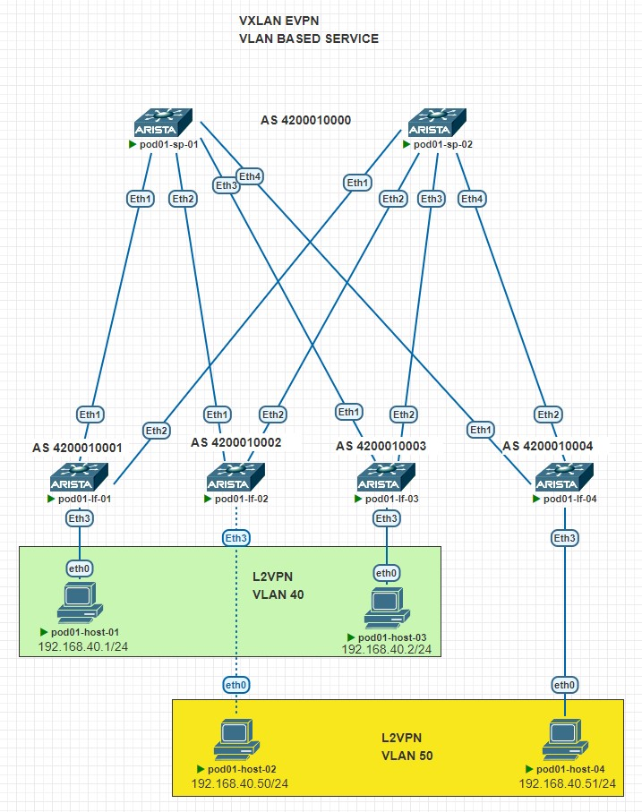
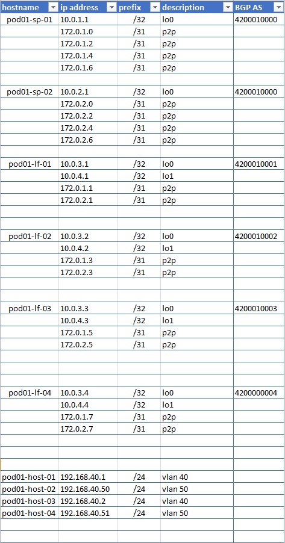
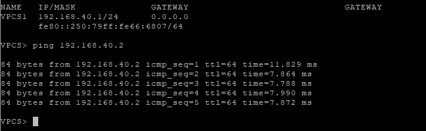
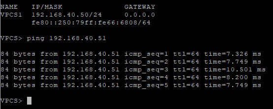

## Цель
- Настроить BGP для Underlay сети
- Настроить BGP для Overlay сети
- Растянуть vlan 40 и 50 
- Настроить VLAN BASED SERVICE

## Схема сети
<details>
<summary>тык</summary>



</details>

## IP PLAN
<details>
<summary>тык</summary>



</details>

## SPINE 01/02
#### Статус BGP пирнга с leafs, для взаимодействия через UNDERLAY 

Принимает по 2 префикса /32 loopback, с каждого leaf

**pod01-sp-01**# sh ip bgp summary
```
Neighbor  V AS           MsgRcvd   MsgSent  InQ OutQ  Up/Down State   PfxRcd PfxAcc
172.0.1.1 4 4200010001      3569      3566    0    0 04:12:29 Estab   2      2
172.0.1.3 4 4200010002      2168      2165    0    0 02:33:08 Estab   2      2
172.0.1.5 4 4200010003      1881      1884    0    0 02:13:14 Estab   2      2
172.0.1.7 4 4200010004      1624      1625    0    0 01:55:18 Estab   2      2
```

**pod01-sp-02**# sh ip bgp summary
```
Neighbor  V AS           MsgRcvd   MsgSent  InQ OutQ  Up/Down State   PfxRcd PfxAcc
172.0.2.1 4 4200010001      1829      1823    0    0 02:09:02 Estab   2      2
172.0.2.3 4 4200010002      1817      1829    0    0 02:09:01 Estab   2      2
172.0.2.5 4 4200010003      1828      1830    0    0 02:09:02 Estab   2      2
172.0.2.7 4 4200010004      1711      1711    0    0 02:01:07 Estab   2      2
```

#### Статус BGP пирнга с leafs, для взаимодействия через OVERLAY

Принимаем 1 префикс, для NVE интерфейса

**pod01-sp-01**# sh bgp evpn summary
```
Neighbor V AS           MsgRcvd   MsgSent  InQ OutQ  Up/Down State   PfxRcd PfxAcc
10.0.3.1 4 4200010001      3681      3662    0    0 04:20:02 Estab   1      1
10.0.3.2 4 4200010002      1847      1856    0    0 02:10:45 Estab   1      1
10.0.3.3 4 4200010003      1990      1991    0    0 02:20:45 Estab   1      1
10.0.3.4 4 4200010004      1744      1745    0    0 02:02:50 Estab   1      1
```

**pod01-sp-02**# sh bgp evpn summary
```
Neighbor V AS           MsgRcvd   MsgSent  InQ OutQ  Up/Down State   PfxRcd PfxAcc
10.0.3.1 4 4200010001      1864      1859    0    0 02:11:09 Estab   1      1
10.0.3.2 4 4200010002      2279      2289    0    0 02:41:10 Estab   1      1
10.0.3.3 4 4200010003      1861      1856    0    0 02:11:15 Estab   1      1
10.0.3.4 4 4200010004      1743      1753    0    0 02:03:20 Estab   1      1
```


#### Сети в BGP таблице на SPINE 01/02


**pod01-sp-01** sh ip bgp
```
          Network                Next Hop              Metric  AIGP       LocPref Weight  Path
 * >      10.0.1.1/32            -                     -       -          -       0       i
 * >      10.0.3.1/32            172.0.1.1             0       -          100     0       4200010001 i
 * >      10.0.3.2/32            172.0.1.3             0       -          100     0       4200010002 i
 * >      10.0.3.3/32            172.0.1.5             0       -          100     0       4200010003 i
 * >      10.0.3.4/32            172.0.1.7             0       -          100     0       4200010004 i
 * >      10.0.4.1/32            172.0.1.1             0       -          100     0       4200010001 i
 * >      10.0.4.2/32            172.0.1.3             0       -          100     0       4200010002 i
 * >      10.0.4.3/32            172.0.1.5             0       -          100     0       4200010003 i
 * >      10.0.4.4/32            172.0.1.7             0       -          100     0       4200010004 i
```

**pod01-sp-02** sh ip bgp
```
          Network                Next Hop              Metric  AIGP       LocPref Weight  Path
 * >      10.0.2.1/32            -                     -       -          -       0       i
 * >      10.0.3.1/32            172.0.2.1             0       -          100     0       4200010001 i
 * >      10.0.3.2/32            172.0.2.3             0       -          100     0       4200010002 i
 * >      10.0.3.3/32            172.0.2.5             0       -          100     0       4200010003 i
 * >      10.0.3.4/32            172.0.2.7             0       -          100     0       4200010004 i
 * >      10.0.4.1/32            172.0.2.1             0       -          100     0       4200010001 i
 * >      10.0.4.2/32            172.0.2.3             0       -          100     0       4200010002 i
 * >      10.0.4.3/32            172.0.2.5             0       -          100     0       4200010003 i
 * >      10.0.4.4/32            172.0.2.7             0       -          100     0       4200010004 i
```

#### Сети в таблице маршрутизации на SPINE 01/02

**pod01-sp-01** sh ip route
```
C        10.0.1.1/32 is directly connected, Loopback0
B E      10.0.3.1/32 [200/0] via 172.0.1.1, Ethernet1
B E      10.0.3.2/32 [200/0] via 172.0.1.3, Ethernet2
B E      10.0.3.3/32 [200/0] via 172.0.1.5, Ethernet3
B E      10.0.3.4/32 [200/0] via 172.0.1.7, Ethernet4
B E      10.0.4.1/32 [200/0] via 172.0.1.1, Ethernet1
B E      10.0.4.2/32 [200/0] via 172.0.1.3, Ethernet2
B E      10.0.4.3/32 [200/0] via 172.0.1.5, Ethernet3
B E      10.0.4.4/32 [200/0] via 172.0.1.7, Ethernet4
C        172.0.1.0/31 is directly connected, Ethernet1
C        172.0.1.2/31 is directly connected, Ethernet2
C        172.0.1.4/31 is directly connected, Ethernet3
C        172.0.1.6/31 is directly connected, Ethernet4
```

**pod01-sp-02** sh ip route
```
C        10.0.2.1/32 is directly connected, Loopback0
B E      10.0.3.1/32 [200/0] via 172.0.2.1, Ethernet1
B E      10.0.3.2/32 [200/0] via 172.0.2.3, Ethernet2
B E      10.0.3.3/32 [200/0] via 172.0.2.5, Ethernet3
B E      10.0.3.4/32 [200/0] via 172.0.2.7, Ethernet4
B E      10.0.4.1/32 [200/0] via 172.0.2.1, Ethernet1
B E      10.0.4.2/32 [200/0] via 172.0.2.3, Ethernet2
B E      10.0.4.3/32 [200/0] via 172.0.2.5, Ethernet3
B E      10.0.4.4/32 [200/0] via 172.0.2.7, Ethernet4
C        172.0.2.0/31 is directly connected, Ethernet1
C        172.0.2.2/31 is directly connected, Ethernet2
C        172.0.2.4/31 is directly connected, Ethernet3
C        172.0.2.6/31 is directly connected, Ethernet4
```

#### Маршруты Type 2(mac-ip) и Type 3(imet) на SPINE 01/02

маршруты со всех leaf 

**pod01-sp-01** sh bgp evpn
```
      Network                Next Hop              Metric  LocPref Weight  Path
* >      RD: 10.0.4.1:10040 mac-ip 0050.7966.6807
                             10.0.4.1              -       100     0       4200010001 i
* >      RD: 10.0.4.2:10050 mac-ip 0050.7966.6808
                             10.0.4.2              -       100     0       4200010002 i
* >      RD: 10.0.4.3:10040 mac-ip 0050.7966.6809
                             10.0.4.3              -       100     0       4200010003 i
* >      RD: 10.0.4.4:10050 mac-ip 0050.7966.680a
                             10.0.4.4              -       100     0       4200010004 i
* >      RD: 10.0.4.1:10040 imet 10.0.4.1
                             10.0.4.1              -       100     0       4200010001 i
* >      RD: 10.0.4.2:10050 imet 10.0.4.2
                             10.0.4.2              -       100     0       4200010002 i
* >      RD: 10.0.4.3:10040 imet 10.0.4.3
                             10.0.4.3              -       100     0       4200010003 i
* >      RD: 10.0.4.4:10050 imet 10.0.4.4
                             10.0.4.4              -       100     0       4200010004 i
```

**pod01-sp-02** sh bgp evpn
```
      Network                Next Hop              Metric  LocPref Weight  Path
* >      RD: 10.0.4.1:10040 mac-ip 0050.7966.6807
                             10.0.4.1              -       100     0       4200010001 i
* >      RD: 10.0.4.2:10050 mac-ip 0050.7966.6808
                             10.0.4.2              -       100     0       4200010002 i
* >      RD: 10.0.4.3:10040 mac-ip 0050.7966.6809
                             10.0.4.3              -       100     0       4200010003 i
* >      RD: 10.0.4.4:10050 mac-ip 0050.7966.680a
                             10.0.4.4              -       100     0       4200010004 i
* >      RD: 10.0.4.1:10040 imet 10.0.4.1
                             10.0.4.1              -       100     0       4200010001 i
* >      RD: 10.0.4.2:10050 imet 10.0.4.2
                             10.0.4.2              -       100     0       4200010002 i
* >      RD: 10.0.4.3:10040 imet 10.0.4.3
                             10.0.4.3              -       100     0       4200010003 i
* >      RD: 10.0.4.4:10050 imet 10.0.4.4
                             10.0.4.4              -       100     0       4200010004 i
```

## LEAF 01/02
#### Статус BGP пирнга с SPINE, для взаимодействия через UNDERLAY 

Информация повторяется, поэтому добавлю информацию, только для LEAF 01/02 на которых терменируется разные vlan 40 и 50, статус по остальным будет виден в BGP таблице маршрутизации

**pod01-lf-01**# sh ip bgp summary
```
Neighbor  V AS           MsgRcvd   MsgSent  InQ OutQ  Up/Down State   PfxRcd PfxAcc
172.0.1.0 4 4200010000      6499      6877    0    0 04:50:56 Estab   7      7
172.0.2.0 4 4200010000      6002      6394    0    0 02:41:40 Estab   7      7
                            
```
**pod01-lf-02**# sh ip bgp summary
```
Neighbor  V AS           MsgRcvd   MsgSent  InQ OutQ  Up/Down State   PfxRcd PfxAcc
172.0.1.2 4 4200010000       580       583    0    0 00:40:54 Estab   7      7
172.0.2.2 4 4200010000       584       580    0    0 00:40:55 Estab   7      7
                            
```

#### Статус BGP пирнга с SPINE, для взаимодействия через OVERLAY

**pod01-lf-01**# sh bgp evpn summary
```
Neighbor V AS           MsgRcvd   MsgSent  InQ OutQ  Up/Down State   PfxRcd PfxAcc
10.0.1.1 4 4200010000      4311      4340    0    0 04:54:34 Estab   3      3
10.0.2.1 4 4200010000      3930      3935    0    0 02:45:11 Estab   3      3
                            
```

**pod01-lf-02**# sh bgp evpn summary
```
Neighbor V AS           MsgRcvd   MsgSent  InQ OutQ  Up/Down State   PfxRcd PfxAcc
10.0.1.1 4 4200010000       601       603    0    0 00:41:59 Estab   3      3
10.0.2.1 4 4200010000       601       606    0    0 00:42:00 Estab   3      3
                            
```

#### Сети в BGP таблице на LEAF 01/02

**pod01-lf-01**# sh ip bgp 
```
         Network                Next Hop              Metric  AIGP       LocPref Weight  Path
* >      10.0.1.1/32            172.0.1.0             0       -          100     0       4200010000 i
* >      10.0.2.1/32            172.0.2.0             0       -          100     0       4200010000 i
* >      10.0.3.1/32            -                     -       -          -       0       i
* >Ec    10.0.3.2/32            172.0.1.0             0       -          100     0       4200010000 4200010002 i
*  ec    10.0.3.2/32            172.0.2.0             0       -          100     0       4200010000 4200010002 i
* >Ec    10.0.3.3/32            172.0.1.0             0       -          100     0       4200010000 4200010003 i
*  ec    10.0.3.3/32            172.0.2.0             0       -          100     0       4200010000 4200010003 i
* >Ec    10.0.3.4/32            172.0.1.0             0       -          100     0       4200010000 4200010004 i
*  ec    10.0.3.4/32            172.0.2.0             0       -          100     0       4200010000 4200010004 i
* >      10.0.4.1/32            -                     -       -          -       0       i
* >Ec    10.0.4.2/32            172.0.1.0             0       -          100     0       4200010000 4200010002 i
*  ec    10.0.4.2/32            172.0.2.0             0       -          100     0       4200010000 4200010002 i
* >Ec    10.0.4.3/32            172.0.1.0             0       -          100     0       4200010000 4200010003 i
*  ec    10.0.4.3/32            172.0.2.0             0       -          100     0       4200010000 4200010003 i
* >Ec    10.0.4.4/32            172.0.1.0             0       -          100     0       4200010000 4200010004 i
*  ec    10.0.4.4/32            172.0.2.0             0       -          100     0       4200010000 4200010004 i
```

**pod01-lf-02**# sh ip bgp 
```
      Network                Next Hop              Metric  AIGP       LocPref Weight  Path
* >      10.0.1.1/32            172.0.1.2             0       -          100     0       4200010000 i
* >      10.0.2.1/32            172.0.2.2             0       -          100     0       4200010000 i
* >Ec    10.0.3.1/32            172.0.2.2             0       -          100     0       4200010000 4200010001 i
*  ec    10.0.3.1/32            172.0.1.2             0       -          100     0       4200010000 4200010001 i
* >      10.0.3.2/32            -                     -       -          -       0       i
* >Ec    10.0.3.3/32            172.0.2.2             0       -          100     0       4200010000 4200010003 i
*  ec    10.0.3.3/32            172.0.1.2             0       -          100     0       4200010000 4200010003 i
* >Ec    10.0.3.4/32            172.0.2.2             0       -          100     0       4200010000 4200010004 i
*  ec    10.0.3.4/32            172.0.1.2             0       -          100     0       4200010000 4200010004 i
* >Ec    10.0.4.1/32            172.0.2.2             0       -          100     0       4200010000 4200010001 i
*  ec    10.0.4.1/32            172.0.1.2             0       -          100     0       4200010000 4200010001 i
* >      10.0.4.2/32            -                     -       -          -       0       i
* >Ec    10.0.4.3/32            172.0.2.2             0       -          100     0       4200010000 4200010003 i
*  ec    10.0.4.3/32            172.0.1.2             0       -          100     0       4200010000 4200010003 i
* >Ec    10.0.4.4/32            172.0.2.2             0       -          100     0       4200010000 4200010004 i
*  ec    10.0.4.4/32            172.0.1.2             0       -          100     0       4200010000 4200010004 i
```

#### Сети в таблице маршрутизации на LEAF 01/02

**pod01-lf-01**# sh ip route
```
 B E      10.0.1.1/32 [200/0] via 172.0.1.0, Ethernet1
 B E      10.0.2.1/32 [200/0] via 172.0.2.0, Ethernet2
 C        10.0.3.1/32 is directly connected, Loopback0
 B E      10.0.3.2/32 [200/0] via 172.0.1.0, Ethernet1
                              via 172.0.2.0, Ethernet2
 B E      10.0.3.3/32 [200/0] via 172.0.1.0, Ethernet1
                              via 172.0.2.0, Ethernet2
 B E      10.0.3.4/32 [200/0] via 172.0.1.0, Ethernet1
                              via 172.0.2.0, Ethernet2
 C        10.0.4.1/32 is directly connected, Loopback1
 B E      10.0.4.2/32 [200/0] via 172.0.1.0, Ethernet1
                              via 172.0.2.0, Ethernet2
 B E      10.0.4.3/32 [200/0] via 172.0.1.0, Ethernet1
                              via 172.0.2.0, Ethernet2
 B E      10.0.4.4/32 [200/0] via 172.0.1.0, Ethernet1
                              via 172.0.2.0, Ethernet2
 C        172.0.1.0/31 is directly connected, Ethernet1
 C        172.0.2.0/31 is directly connected, Ethernet2
```

**pod01-lf-02**# sh ip route
```
 B E      10.0.1.1/32 [200/0] via 172.0.1.2, Ethernet1
 B E      10.0.2.1/32 [200/0] via 172.0.2.2, Ethernet2
 B E      10.0.3.1/32 [200/0] via 172.0.1.2, Ethernet1
                              via 172.0.2.2, Ethernet2
 C        10.0.3.2/32 is directly connected, Loopback0
 B E      10.0.3.3/32 [200/0] via 172.0.1.2, Ethernet1
                              via 172.0.2.2, Ethernet2
 B E      10.0.3.4/32 [200/0] via 172.0.1.2, Ethernet1
                              via 172.0.2.2, Ethernet2
 B E      10.0.4.1/32 [200/0] via 172.0.1.2, Ethernet1
                              via 172.0.2.2, Ethernet2
 C        10.0.4.2/32 is directly connected, Loopback1
 B E      10.0.4.3/32 [200/0] via 172.0.1.2, Ethernet1
                              via 172.0.2.2, Ethernet2
 B E      10.0.4.4/32 [200/0] via 172.0.1.2, Ethernet1
                              via 172.0.2.2, Ethernet2
 C        172.0.1.2/31 is directly connected, Ethernet1
 C        172.0.2.2/31 is directly connected, Ethernet2
```

#### Маршруты Type 2(mac-ip) и Type 3(imet) на LEAF 01/02

**pod01-lf-01**# sh bgp evpn 
```
* >      RD: 10.0.4.1:10040 mac-ip 0050.7966.6807
                             -                     -       -       0       i
* >Ec    RD: 10.0.4.2:10050 mac-ip 0050.7966.6808
                             10.0.4.2              -       100     0       4200010000 4200010002 i
*  ec    RD: 10.0.4.2:10050 mac-ip 0050.7966.6808
                             10.0.4.2              -       100     0       4200010000 4200010002 i
* >Ec    RD: 10.0.4.3:10040 mac-ip 0050.7966.6809
                             10.0.4.3              -       100     0       4200010000 4200010003 i
*  ec    RD: 10.0.4.3:10040 mac-ip 0050.7966.6809
                             10.0.4.3              -       100     0       4200010000 4200010003 i
* >Ec    RD: 10.0.4.4:10050 mac-ip 0050.7966.680a
                             10.0.4.4              -       100     0       4200010000 4200010004 i
*  ec    RD: 10.0.4.4:10050 mac-ip 0050.7966.680a
                             10.0.4.4              -       100     0       4200010000 4200010004 i
* >Ec    RD: 10.0.4.2:10050 imet 10.0.4.2
                             10.0.4.2              -       100     0       4200010000 4200010002 i
*  ec    RD: 10.0.4.2:10050 imet 10.0.4.2
                             10.0.4.2              -       100     0       4200010000 4200010002 i
* >Ec    RD: 10.0.4.3:10040 imet 10.0.4.3
                             10.0.4.3              -       100     0       4200010000 4200010003 i
*  ec    RD: 10.0.4.3:10040 imet 10.0.4.3
                             10.0.4.3              -       100     0       4200010000 4200010003 i
* >Ec    RD: 10.0.4.4:10050 imet 10.0.4.4
                             10.0.4.4              -       100     0       4200010000 4200010004 i
*  ec    RD: 10.0.4.4:10050 imet 10.0.4.4
                             10.0.4.4              -       100     0       4200010000 4200010004 i
* >      RD: 10.0.4.1:10040 imet 10.0.4.1
                                 -                     -       -       0       i        
```

**pod01-lf-02**# sh bgp evpn 
```
          Network                Next Hop              Metric  LocPref Weight  Path
* >Ec    RD: 10.0.4.1:10040 mac-ip 0050.7966.6807
                             10.0.4.1              -       100     0       4200010000 4200010001 i
*  ec    RD: 10.0.4.1:10040 mac-ip 0050.7966.6807
                             10.0.4.1              -       100     0       4200010000 4200010001 i
* >      RD: 10.0.4.2:10050 mac-ip 0050.7966.6808
                             -                     -       -       0       i
* >Ec    RD: 10.0.4.3:10040 mac-ip 0050.7966.6809
                             10.0.4.3              -       100     0       4200010000 4200010003 i
*  ec    RD: 10.0.4.3:10040 mac-ip 0050.7966.6809
                             10.0.4.3              -       100     0       4200010000 4200010003 i
* >Ec    RD: 10.0.4.4:10050 mac-ip 0050.7966.680a
                             10.0.4.4              -       100     0       4200010000 4200010004 i
*  ec    RD: 10.0.4.4:10050 mac-ip 0050.7966.680a
                             10.0.4.4              -       100     0       4200010000 4200010004 i
* >Ec    RD: 10.0.4.1:10040 imet 10.0.4.1
                             10.0.4.1              -       100     0       4200010000 4200010001 i
*  ec    RD: 10.0.4.1:10040 imet 10.0.4.1
                             10.0.4.1              -       100     0       4200010000 4200010001 i
* >Ec    RD: 10.0.4.3:10040 imet 10.0.4.3
                             10.0.4.3              -       100     0       4200010000 4200010003 i
*  ec    RD: 10.0.4.3:10040 imet 10.0.4.3
                             10.0.4.3              -       100     0       4200010000 4200010003 i
* >Ec    RD: 10.0.4.4:10050 imet 10.0.4.4
                             10.0.4.4              -       100     0       4200010000 4200010004 i
*  ec    RD: 10.0.4.4:10050 imet 10.0.4.4
                             10.0.4.4              -       100     0       4200010000 4200010004 i
* >      RD: 10.0.4.2:10050 imet 10.0.4.2
                             -                     -       -       0       i                 
```

**pod01-lf-01**# sh vxlan address-table
```
VLAN  Mac Address     Type      Prt  VTEP             Moves   Last Move
----  -----------     ----      ---  ----             -----   ---------
  40  0050.7966.6809  EVPN      Vx1  10.0.4.3         1       0:04:19 ago
                            
```

**pod01-lf-02**# sh vxlan address-table
```
VLAN  Mac Address     Type      Prt  VTEP             Moves   Last Move
----  -----------     ----      ---  ----             -----   ---------
  50  0050.7966.680a  EVPN      Vx1  10.0.4.4         1       0:04:14 ago
                            
```

#### Доступность между хостами 
ping между растянутым VLAN 40 pod01-host-01->pod01-host-03


ping между растянутым VLAN 50 pod01-host-02->pod01-host-04


### Полный конфиг устройств располагается в папке config
