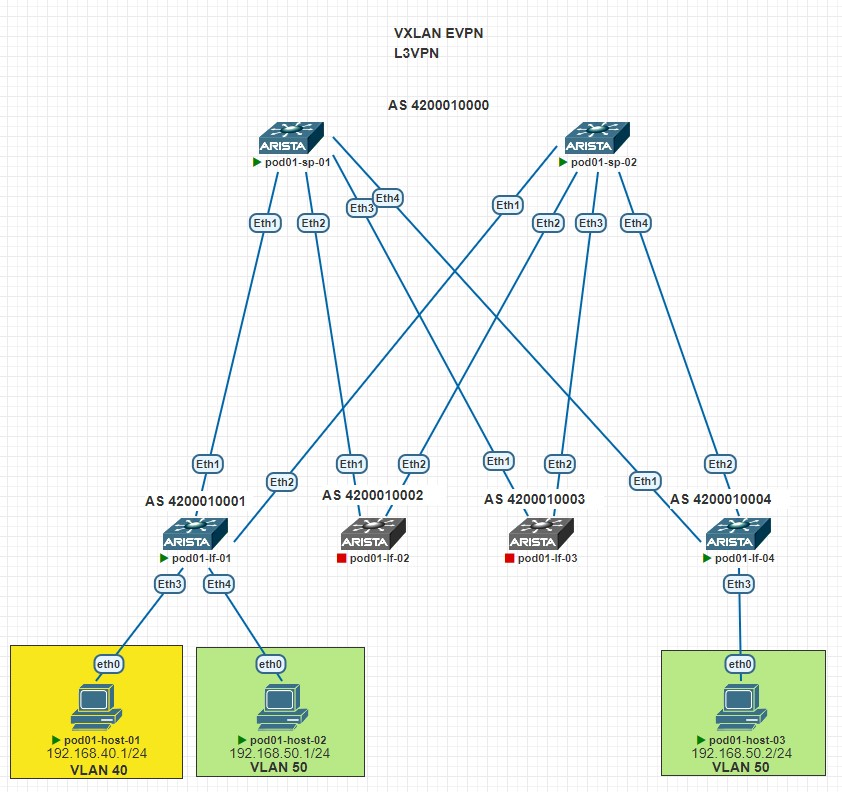
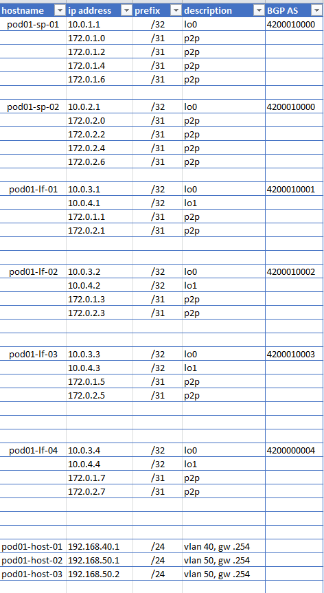
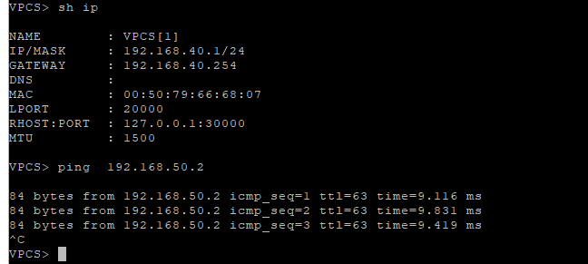
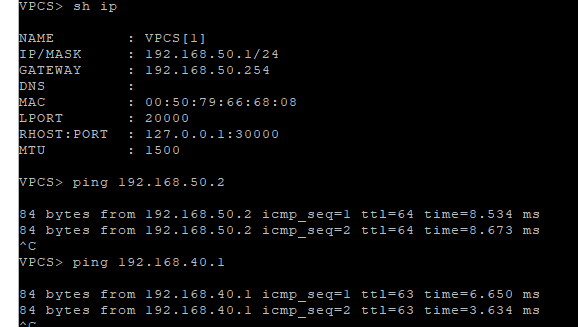
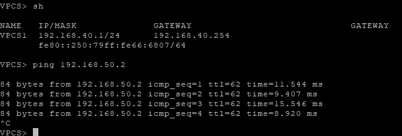

## Цель
- Настроить VXVLAN EVPN L3VPN
- Модель Asymmetric IRB
- Модель Symmetric IRB

## Схема сети
<details>
<summary>тык</summary>



</details>

## IP PLAN
<details>
<summary>тык</summary>



</details>


# Настройка Asymmetric IRB
Настройка UNDERLAY и OVERLAY не изменялась с предыдущего задания. В данном задание, только настройка L3VPN 

#### Конфигурация

**pod01-lf-01**

```
vlan 40, 50

interface Vlan40
   vrf PROD
   ip address virtual 192.168.40.254/24

interface Vlan50
   vrf PROD
   ip address virtual 192.168.50.254/24

interface Vxlan1
   vxlan source-interface Loopback1
   vxlan vlan 40 vni 10040
   vxlan vlan 50 vni 10050

ip virtual-router mac-address 00:00:00:00:01:01

vrf instance PROD
ip routing vrf PROD

router bgp 4200010001
   vlan 40
      rd 10.0.4.1:10040
      route-target both 1:10040
      redistribute learned
   
   vlan 50
      rd 10.0.4.1:10050
      route-target both 1:10050
      redistribute learned

```

**pod01-lf-04**

```
vlan 40, 50

interface Vlan40
   vrf PROD
   ip address virtual 192.168.40.254/24

interface Vlan50
   vrf PROD
   ip address virtual 192.168.50.254/24

interface Vxlan1
   vxlan source-interface Loopback1
   vxlan vlan 40 vni 10040
   vxlan vlan 50 vni 10050

ip virtual-router mac-address 00:00:00:00:01:01

vrf instance PROD
ip routing vrf PROD

router bgp 4200010004
   vlan 40
      rd 10.0.4.4:10040
      route-target both 1:10040
      redistribute learned
   
   vlan 50
      rd 10.0.4.4:10050
      route-target both 1:10050
      redistribute learned

```

#### Маршруты Type 2(mac-ip) и Type 3(imet) на LEAF 01, 04


**pod01-lf-01** sh bgp evpn
```
     Network                Next Hop              Metric  LocPref Weight  Path
* >      RD: 10.0.4.1:10040 mac-ip 0050.7966.6807
                             -                     -       -       0       i
* >      RD: 10.0.4.1:10040 mac-ip 0050.7966.6807 192.168.40.1
                             -                     -       -       0       i
* >      RD: 10.0.4.1:10050 mac-ip 0050.7966.6808
                             -                     -       -       0       i
* >      RD: 10.0.4.1:10050 mac-ip 0050.7966.6808 192.168.50.1
                             -                     -       -       0       i
* >Ec    RD: 10.0.4.4:10050 mac-ip 0050.7966.680a
                             10.0.4.4              -       100     0       4200010000 4200010004 i
*  ec    RD: 10.0.4.4:10050 mac-ip 0050.7966.680a
                             10.0.4.4              -       100     0       4200010000 4200010004 i
* >Ec    RD: 10.0.4.4:10050 mac-ip 0050.7966.680a 192.168.50.2
                             10.0.4.4              -       100     0       4200010000 4200010004 i
*  ec    RD: 10.0.4.4:10050 mac-ip 0050.7966.680a 192.168.50.2
                             10.0.4.4              -       100     0       4200010000 4200010004 i
* >Ec    RD: 10.0.4.4:10040 imet 10.0.4.4
                             10.0.4.4              -       100     0       4200010000 4200010004 i
*  ec    RD: 10.0.4.4:10040 imet 10.0.4.4
                             10.0.4.4              -       100     0       4200010000 4200010004 i
* >Ec    RD: 10.0.4.4:10050 imet 10.0.4.4
                             10.0.4.4              -       100     0       4200010000 4200010004 i
*  ec    RD: 10.0.4.4:10050 imet 10.0.4.4
                             10.0.4.4              -       100     0       4200010000 4200010004 i
* >      RD: 10.0.4.1:10040 imet 10.0.4.1
                             -                     -       -       0       i
* >      RD: 10.0.4.1:10050 imet 10.0.4.1
                             -                     -       -       0       i
```

**pod01-lf-04** sh bgp evpn
```
      Network                Next Hop              Metric  LocPref Weight  Path
* >Ec    RD: 10.0.4.1:10040 mac-ip 0050.7966.6807
                             10.0.4.1              -       100     0       4200010000 4200010001 i
*  ec    RD: 10.0.4.1:10040 mac-ip 0050.7966.6807
                             10.0.4.1              -       100     0       4200010000 4200010001 i
* >Ec    RD: 10.0.4.1:10040 mac-ip 0050.7966.6807 192.168.40.1
                             10.0.4.1              -       100     0       4200010000 4200010001 i
*  ec    RD: 10.0.4.1:10040 mac-ip 0050.7966.6807 192.168.40.1
                             10.0.4.1              -       100     0       4200010000 4200010001 i
* >Ec    RD: 10.0.4.1:10050 mac-ip 0050.7966.6808
                             10.0.4.1              -       100     0       4200010000 4200010001 i
*  ec    RD: 10.0.4.1:10050 mac-ip 0050.7966.6808
                             10.0.4.1              -       100     0       4200010000 4200010001 i
* >Ec    RD: 10.0.4.1:10050 mac-ip 0050.7966.6808 192.168.50.1
                             10.0.4.1              -       100     0       4200010000 4200010001 i
*  ec    RD: 10.0.4.1:10050 mac-ip 0050.7966.6808 192.168.50.1
                             10.0.4.1              -       100     0       4200010000 4200010001 i
* >      RD: 10.0.4.4:10050 mac-ip 0050.7966.680a
                             -                     -       -       0       i
* >      RD: 10.0.4.4:10050 mac-ip 0050.7966.680a 192.168.50.2
                             -                     -       -       0       i
* >Ec    RD: 10.0.4.1:10040 imet 10.0.4.1
                             10.0.4.1              -       100     0       4200010000 4200010001 i
*  ec    RD: 10.0.4.1:10040 imet 10.0.4.1
                             10.0.4.1              -       100     0       4200010000 4200010001 i
* >Ec    RD: 10.0.4.1:10050 imet 10.0.4.1
                             10.0.4.1              -       100     0       4200010000 4200010001 i
*  ec    RD: 10.0.4.1:10050 imet 10.0.4.1
                             10.0.4.1              -       100     0       4200010000 4200010001 i
* >      RD: 10.0.4.4:10040 imet 10.0.4.4
                             -                     -       -       0       i
* >      RD: 10.0.4.4:10050 imet 10.0.4.4
                             -                     -       -       0       i
```

**pod01-lf-01** sh arp vrf PROD
```
Address         Age (sec)  Hardware Addr   Interface
192.168.40.1      0:00:24  0050.7966.6807  Vlan40, Ethernet3
192.168.50.1      0:00:24  0050.7966.6808  Vlan50, Ethernet4
192.168.50.2            -  0050.7966.680a  Vlan50, Vxlan1

```

**pod01-lf-04** sh arp vrf PROD

```
Address         Age (sec)  Hardware Addr   Interface
192.168.40.1            -  0050.7966.6807  Vlan40, Vxlan1
192.168.50.1            -  0050.7966.6808  Vlan50, Vxlan1
192.168.50.2      0:03:26  0050.7966.680a  Vlan50, Ethernet3

```

**pod01-lf-01** sh mac address-table
```
          Mac Address Table
------------------------------------------------------------------

Vlan    Mac Address       Type        Ports      Moves   Last Move
----    -----------       ----        -----      -----   ---------
  40    0050.7966.6807    DYNAMIC     Et3        1       0:03:09 ago
  50    0050.7966.6808    DYNAMIC     Et4        1       0:00:47 ago
  50    0050.7966.680a    DYNAMIC     Vx1        1       0:03:08 ago

```

**pod01-lf-04** sh mac address-table
```
          Mac Address Table
------------------------------------------------------------------

Vlan    Mac Address       Type        Ports      Moves   Last Move
----    -----------       ----        -----      -----   ---------
  40    0050.7966.6807    DYNAMIC     Vx1        1       0:03:34 ago
  50    0050.7966.6808    DYNAMIC     Vx1        1       0:01:12 ago
  50    0050.7966.680a    DYNAMIC     Et3        1       0:03:34 ago
Total Mac Addresses for this criterion: 3
```

#### Доступность между хостами 
pod01-host-01->pod01-host-03 ping между VLAN 40 и VLAN 50 



1. pod01-host-02 ping между VLAN 40 и VLAN 50 в рамкого своего leaf
2. пинг между растянутым VLAN 50




# Настройка Symmetric IRB

**pod01-lf-01** 

```
interface Vxlan1
vxlan vrf PROD vni 11111

vrf PROD
  rd 10.0.4.1:11111
  route-target import evpn 1:11111
  route-target export evpn 1:11111
```

**pod01-lf-04** 

```
no vlan 40
no int vlan 40

interface Vxlan1
vxlan vrf PROD vni 11111

vrf PROD
  rd 10.0.4.4:11111
  route-target import evpn 1:11111
  route-target export evpn 1:11111
```

#### Маршруты Type 2(mac-ip) и Type 3(imet) на LEAF 01, 04


**pod01-lf-01** sh bgp evpn
```
      Network                Next Hop              Metric  LocPref Weight  Path
* >      RD: 10.0.4.1:10040 mac-ip 0050.7966.6807
                             -                     -       -       0       i
* >      RD: 10.0.4.1:10040 mac-ip 0050.7966.6807 192.168.40.1
                             -                     -       -       0       i
* >      RD: 10.0.4.1:10050 mac-ip 0050.7966.6808
                             -                     -       -       0       i
* >      RD: 10.0.4.1:10050 mac-ip 0050.7966.6808 192.168.50.1
                             -                     -       -       0       i
* >Ec    RD: 10.0.4.4:10050 mac-ip 0050.7966.680a
                             10.0.4.4              -       100     0       4200010000 4200010004 i
*  ec    RD: 10.0.4.4:10050 mac-ip 0050.7966.680a
                             10.0.4.4              -       100     0       4200010000 4200010004 i
* >Ec    RD: 10.0.4.4:10050 mac-ip 0050.7966.680a 192.168.50.2
                             10.0.4.4              -       100     0       4200010000 4200010004 i
*  ec    RD: 10.0.4.4:10050 mac-ip 0050.7966.680a 192.168.50.2
                             10.0.4.4              -       100     0       4200010000 4200010004 i
* >Ec    RD: 10.0.4.4:10050 imet 10.0.4.4
                             10.0.4.4              -       100     0       4200010000 4200010004 i
*  ec    RD: 10.0.4.4:10050 imet 10.0.4.4
                             10.0.4.4              -       100     0       4200010000 4200010004 i
* >      RD: 10.0.4.1:10040 imet 10.0.4.1
                             -                     -       -       0       i
* >      RD: 10.0.4.1:10050 imet 10.0.4.1
                             -                     -       -       0       i
```

**pod01-lf-04** sh bgp evpn
```
            Network                Next Hop              Metric  LocPref Weight  Path
* >Ec    RD: 10.0.4.1:10040 mac-ip 0050.7966.6807
                             10.0.4.1              -       100     0       4200010000 4200010001 i
*  ec    RD: 10.0.4.1:10040 mac-ip 0050.7966.6807
                             10.0.4.1              -       100     0       4200010000 4200010001 i
* >Ec    RD: 10.0.4.1:10040 mac-ip 0050.7966.6807 192.168.40.1
                             10.0.4.1              -       100     0       4200010000 4200010001 i
*  ec    RD: 10.0.4.1:10040 mac-ip 0050.7966.6807 192.168.40.1
                             10.0.4.1              -       100     0       4200010000 4200010001 i
* >Ec    RD: 10.0.4.1:10050 mac-ip 0050.7966.6808
                             10.0.4.1              -       100     0       4200010000 4200010001 i
*  ec    RD: 10.0.4.1:10050 mac-ip 0050.7966.6808
                             10.0.4.1              -       100     0       4200010000 4200010001 i
* >Ec    RD: 10.0.4.1:10050 mac-ip 0050.7966.6808 192.168.50.1
                             10.0.4.1              -       100     0       4200010000 4200010001 i
*  ec    RD: 10.0.4.1:10050 mac-ip 0050.7966.6808 192.168.50.1
                             10.0.4.1              -       100     0       4200010000 4200010001 i
* >      RD: 10.0.4.4:10050 mac-ip 0050.7966.680a
                             -                     -       -       0       i
* >      RD: 10.0.4.4:10050 mac-ip 0050.7966.680a 192.168.50.2
                             -                     -       -       0       i
* >Ec    RD: 10.0.4.1:10040 imet 10.0.4.1
                             10.0.4.1              -       100     0       4200010000 4200010001 i
*  ec    RD: 10.0.4.1:10040 imet 10.0.4.1
                             10.0.4.1              -       100     0       4200010000 4200010001 i
* >Ec    RD: 10.0.4.1:10050 imet 10.0.4.1
                             10.0.4.1              -       100     0       4200010000 4200010001 i
*  ec    RD: 10.0.4.1:10050 imet 10.0.4.1
                             10.0.4.1              -       100     0       4200010000 4200010001 i
* >      RD: 10.0.4.4:10050 imet 10.0.4.4
                             -                     -       -       0       i
```

#### маршруты в RIB

**pod01-lf-01** sh ip route vrf PROD

```
C        192.168.40.0/24 is directly connected, Vlan40
B E      192.168.50.2/32 [200/0] via VTEP 10.0.4.4 VNI 11111 router-mac 50:c6:ce:49:a6:be local-interface Vxlan1
C        192.168.50.0/24 is directly connected, Vlan50

```
**pod01-lf-04** sh ip route vrf PROD

```
B E      192.168.40.1/32 [200/0] via VTEP 10.0.4.1 VNI 11111 router-mac 50:c2:a7:de:68:01 local-interface Vxlan1
B E      192.168.50.1/32 [200/0] via VTEP 10.0.4.1 VNI 11111 router-mac 50:c2:a7:de:68:01 local-interface Vxlan1
C        192.168.50.0/24 is directly connected, Vlan50

```
pod01-host-01->pod01-host-03 ping между VLAN 40 и VLAN 50 




### Полный конфиг устройств располагается в папке config