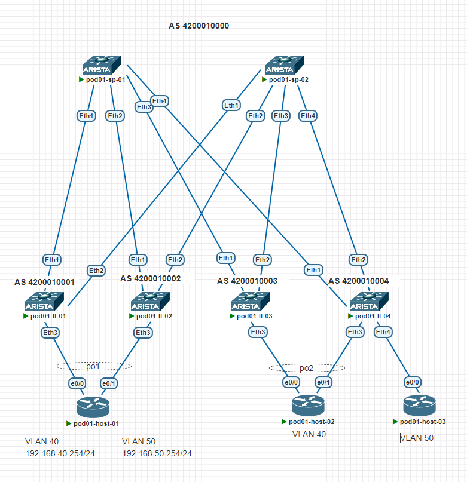
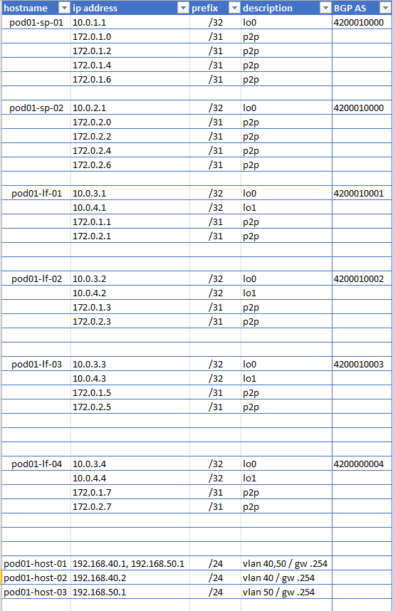

## Цель
- Настроить EVPN Active/Active
- host 1 сможет взамидействовать с растянутыми vlan 40, 50
- host 2 сможет взамидействовать, только с vlan 40
- host 3 подключить, одной ногой к pod01-lf-04, который сможет взамидействовать, только с vlan 50


## Схема сети
<details>
<summary>тык</summary>



</details>

## IP PLAN
<details>
<summary>тык</summary>



</details>


# Настройка MLAG
Настройка UNDERLAY и OVERLAY не изменялась с предыдущего задания. В данном задании, настройка EVPN Active/Active

#### Конфигурация

**pod01-lf-01/02**

```
interface Port-Channel1
   switchport trunk allowed vlan 40,50
   switchport mode trunk
 
    evpn ethernet-segment
      identifier 0000:0000:0001:0001:0000
      route-target import 00:00:00:01:00:01
    lacp system-id 0000.0000.0001
    
interface Ethernet3
   channel-group 1 mode active

```

```
vrf instance DEV

interface Vlan50
   vrf DEV
   ip address virtual 192.168.50.254/24
   
ip routing vrf DEV
```


**pod01-lf-03**

```
interface Port-Channel2
   switchport trunk allowed vlan 40
   switchport mode trunk
   !
   evpn ethernet-segment
      identifier 0000:0000:0001:0002:0000
      route-target import 00:00:00:01:00:02
   lacp system-id 0000.0000.0002
    
interface Ethernet3
   channel-group 2 mode active

```

**pod01-lf-04**

```
interface Port-Channel2
   switchport trunk allowed vlan 40
   switchport mode trunk
   !
   evpn ethernet-segment
      identifier 0000:0000:0001:0002:0000
      route-target import 00:00:00:01:00:02
   lacp system-id 0000.0000.0002
    
interface Ethernet3
    description to_host_02
   channel-group 2 mode active

interface Ethernet4
   description to_host_03
   switchport trunk allowed vlan 50
   switchport mode trunk
```

```
vrf instance DEV

interface Vlan50
   vrf DEV
   ip address virtual 192.168.50.254/24

ip routing vrf DEV
```

#### Состояние port-channel

**pod01-lf-01**  show port-channel dense
```
                 Flags
------------------------ ---------------------------- -------------------------
  a - LACP Active          p - LACP Passive           * - static fallback
  F - Fallback enabled     f - Fallback configured    ^ - individual fallback
  U - In Use               D - Down
  + - In-Sync              - - Out-of-Sync            i - incompatible with agg
  P - bundled in Po        s - suspended              G - Aggregable
  I - Individual           S - ShortTimeout           w - wait for agg
  E - Inactive. The number of configured port channels exceeds the config limit
   M - Exceeds maximum weight

Number of channels in use: 1
Number of aggregators: 1

   Port-Channel       Protocol    Ports
------------------ -------------- ---------
   Po1(U)             LACP(a)     Et3(PG+)

```
**pod01-lf-02** show port-channel dense

```

Number of channels in use: 1
Number of aggregators: 1

   Port-Channel       Protocol    Ports
------------------ -------------- ---------
   Po1(U)             LACP(a)     Et3(PG+)
```
**pod01-lf-03** show port-channel dense
```

Number of channels in use: 1
Number of aggregators: 1

   Port-Channel       Protocol    Ports
------------------ -------------- ---------
   Po2(U)             LACP(a)     Et3(PG+)

```

**pod01-lf-04** show port-channel dense

```
Number of channels in use: 1
Number of aggregators: 1

   Port-Channel       Protocol    Ports
------------------ -------------- ---------
   Po2(U)             LACP(a)     Et3(PG+)
```

#### Выбор DF для BUM трафика

**pod01-lf-01** show bgp evpn instance vlan 40/50

```

EVPN instance: VLAN 40
  Route distinguisher: 10.0.4.1:10040
  Route target import: Route-Target-AS:1:10040
  Route target export: Route-Target-AS:1:10040
  Service interface: VLAN-based
  Local VXLAN IP address: 10.0.4.1
  VXLAN: enabled
  MPLS: disabled
  Local ethernet segment:
    ESI: 0000:0000:0001:0001:0000
      Interface: Port-Channel1
      Mode: all-active
      State: up
      ES-Import RT: 00:00:00:01:00:01
      DF election algorithm: modulus
      Designated forwarder: 10.0.4.1
      Non-Designated forwarder: 10.0.4.2
      

EVPN instance: VLAN 50
  Route distinguisher: 10.0.4.1:10050
  Route target import: Route-Target-AS:1:10050
  Route target export: Route-Target-AS:1:10050
  Service interface: VLAN-based
  Local VXLAN IP address: 10.0.4.1
  VXLAN: enabled
  MPLS: disabled
  Local ethernet segment:
    ESI: 0000:0000:0001:0001:0000
      Interface: Port-Channel1
      Mode: all-active
      State: up
      ES-Import RT: 00:00:00:01:00:01
      DF election algorithm: modulus
      Designated forwarder: 10.0.4.1
      Non-Designated forwarder: 10.0.4.2

```
**pod01-lf-03** show bgp evpn instance vlan 40

```
EVPN instance: VLAN 40
  Route distinguisher: 10.0.4.3:10040
  Route target import: Route-Target-AS:1:10040
  Route target export: Route-Target-AS:1:10040
  Service interface: VLAN-based
  Local VXLAN IP address: 10.0.4.3
  VXLAN: enabled
  MPLS: disabled
  Local ethernet segment:
    ESI: 0000:0000:0001:0002:0000
      Interface: Port-Channel2
      Mode: all-active
      State: up
      ES-Import RT: 00:00:00:01:00:02
      DF election algorithm: modulus
      Designated forwarder: 10.0.4.3
      Non-Designated forwarder: 10.0.4.4

```


#### Маршруты Type 1(auto-discovery) и Type 4(ethernet-segment) на LEAF 01, 02, 03, 04
**pod01-lf-01** sh bgp evpn route-type ethernet-segment
```
BGP routing table information for VRF default
Router identifier 10.0.3.1, local AS number 4200010001
Route status codes: * - valid, > - active, S - Stale, E - ECMP head, e - ECMP
                    c - Contributing to ECMP, % - Pending BGP convergence
Origin codes: i - IGP, e - EGP, ? - incomplete
AS Path Attributes: Or-ID - Originator ID, C-LST - Cluster List, LL Nexthop - Link Local Nexthop

          Network                Next Hop              Metric  LocPref Weight  Path
 * >      RD: 10.0.4.1:1 ethernet-segment 0000:0000:0001:0001:0000 10.0.4.1
                                 -                     -       -       0       i
 * >Ec    RD: 10.0.4.2:1 ethernet-segment 0000:0000:0001:0001:0000 10.0.4.2
                                 10.0.4.2              -       100     0       4200010000 4200010002 i
 *  ec    RD: 10.0.4.2:1 ethernet-segment 0000:0000:0001:0001:0000 10.0.4.2
                                 10.0.4.2              -       100     0       4200010000 4200010002 i
 * >Ec    RD: 10.0.4.3:1 ethernet-segment 0000:0000:0001:0002:0000 10.0.4.3
                                 10.0.4.3              -       100     0       4200010000 4200010003 i
 *  ec    RD: 10.0.4.3:1 ethernet-segment 0000:0000:0001:0002:0000 10.0.4.3
                                 10.0.4.3              -       100     0       4200010000 4200010003 i
 * >Ec    RD: 10.0.4.4:1 ethernet-segment 0000:0000:0001:0002:0000 10.0.4.4
                                 10.0.4.4              -       100     0       4200010000 4200010004 i
 *  ec    RD: 10.0.4.4:1 ethernet-segment 0000:0000:0001:0002:0000 10.0.4.4
                                 10.0.4.4              -       100     0       4200010000 4200010004 i

```

**pod01-lf-01** sh bgp evpn route-type auto-discovery

```
BGP routing table information for VRF default
Router identifier 10.0.3.1, local AS number 4200010001
Route status codes: * - valid, > - active, S - Stale, E - ECMP head, e - ECMP
                    c - Contributing to ECMP, % - Pending BGP convergence
Origin codes: i - IGP, e - EGP, ? - incomplete
AS Path Attributes: Or-ID - Originator ID, C-LST - Cluster List, LL Nexthop - Link Local Nexthop

          Network                Next Hop              Metric  LocPref Weight  Path
 * >      RD: 10.0.4.1:10040 auto-discovery 0 0000:0000:0001:0001:0000
                                 -                     -       -       0       i
 * >      RD: 10.0.4.1:10050 auto-discovery 0 0000:0000:0001:0001:0000
                                 -                     -       -       0       i
 * >Ec    RD: 10.0.4.2:10040 auto-discovery 0 0000:0000:0001:0001:0000
                                 10.0.4.2              -       100     0       4200010000 4200010002 i
 *  ec    RD: 10.0.4.2:10040 auto-discovery 0 0000:0000:0001:0001:0000
                                 10.0.4.2              -       100     0       4200010000 4200010002 i
 * >Ec    RD: 10.0.4.2:10050 auto-discovery 0 0000:0000:0001:0001:0000
                                 10.0.4.2              -       100     0       4200010000 4200010002 i
 *  ec    RD: 10.0.4.2:10050 auto-discovery 0 0000:0000:0001:0001:0000
                                 10.0.4.2              -       100     0       4200010000 4200010002 i
 * >      RD: 10.0.4.1:1 auto-discovery 0000:0000:0001:0001:0000
                                 -                     -       -       0       i
 * >Ec    RD: 10.0.4.2:1 auto-discovery 0000:0000:0001:0001:0000
                                 10.0.4.2              -       100     0       4200010000 4200010002 i
 *  ec    RD: 10.0.4.2:1 auto-discovery 0000:0000:0001:0001:0000
                                 10.0.4.2              -       100     0       4200010000 4200010002 i
 * >Ec    RD: 10.0.4.3:10040 auto-discovery 0 0000:0000:0001:0002:0000
                                 10.0.4.3              -       100     0       4200010000 4200010003 i
 *  ec    RD: 10.0.4.3:10040 auto-discovery 0 0000:0000:0001:0002:0000
                                 10.0.4.3              -       100     0       4200010000 4200010003 i
 * >Ec    RD: 10.0.4.4:10040 auto-discovery 0 0000:0000:0001:0002:0000
                                 10.0.4.4              -       100     0       4200010000 4200010004 i
 *  ec    RD: 10.0.4.4:10040 auto-discovery 0 0000:0000:0001:0002:0000
                                 10.0.4.4              -       100     0       4200010000 4200010004 i
 * >Ec    RD: 10.0.4.3:1 auto-discovery 0000:0000:0001:0002:0000
                                 10.0.4.3              -       100     0       4200010000 4200010003 i
 *  ec    RD: 10.0.4.3:1 auto-discovery 0000:0000:0001:0002:0000
                                 10.0.4.3              -       100     0       4200010000 4200010003 i
 * >Ec    RD: 10.0.4.4:1 auto-discovery 0000:0000:0001:0002:0000
                                 10.0.4.4              -       100     0       4200010000 4200010004 i
 *  ec    RD: 10.0.4.4:1 auto-discovery 0000:0000:0001:0002:0000
                                 10.0.4.4              -       100     0       4200010000 4200010004 i

```

**pod01-lf-03** sh bgp evpn route-type ethernet-segment
```
BGP routing table information for VRF default
Router identifier 10.0.3.3, local AS number 4200010003
Route status codes: * - valid, > - active, S - Stale, E - ECMP head, e - ECMP
                    c - Contributing to ECMP, % - Pending BGP convergence
Origin codes: i - IGP, e - EGP, ? - incomplete
AS Path Attributes: Or-ID - Originator ID, C-LST - Cluster List, LL Nexthop - Link Local Nexthop

          Network                Next Hop              Metric  LocPref Weight  Path
 * >Ec    RD: 10.0.4.1:1 ethernet-segment 0000:0000:0001:0001:0000 10.0.4.1
                                 10.0.4.1              -       100     0       4200010000 4200010001 i
 *  ec    RD: 10.0.4.1:1 ethernet-segment 0000:0000:0001:0001:0000 10.0.4.1
                                 10.0.4.1              -       100     0       4200010000 4200010001 i
 * >Ec    RD: 10.0.4.2:1 ethernet-segment 0000:0000:0001:0001:0000 10.0.4.2
                                 10.0.4.2              -       100     0       4200010000 4200010002 i
 *  ec    RD: 10.0.4.2:1 ethernet-segment 0000:0000:0001:0001:0000 10.0.4.2
                                 10.0.4.2              -       100     0       4200010000 4200010002 i
 * >      RD: 10.0.4.3:1 ethernet-segment 0000:0000:0001:0002:0000 10.0.4.3
                                 -                     -       -       0       i
 * >Ec    RD: 10.0.4.4:1 ethernet-segment 0000:0000:0001:0002:0000 10.0.4.4
                                 10.0.4.4              -       100     0       4200010000 4200010004 i
 *  ec    RD: 10.0.4.4:1 ethernet-segment 0000:0000:0001:0002:0000 10.0.4.4
                                 10.0.4.4              -       100     0       4200010000 4200010004 i
```

**pod01-lf-04** sh bgp evpn route-type auto-discovery
```
BGP routing table information for VRF default
Router identifier 10.0.3.3, local AS number 4200010003
Route status codes: * - valid, > - active, S - Stale, E - ECMP head, e - ECMP
                    c - Contributing to ECMP, % - Pending BGP convergence
Origin codes: i - IGP, e - EGP, ? - incomplete
AS Path Attributes: Or-ID - Originator ID, C-LST - Cluster List, LL Nexthop - Link Local Nexthop

          Network                Next Hop              Metric  LocPref Weight  Path
 * >Ec    RD: 10.0.4.1:10040 auto-discovery 0 0000:0000:0001:0001:0000
                                 10.0.4.1              -       100     0       4200010000 4200010001 i
 *  ec    RD: 10.0.4.1:10040 auto-discovery 0 0000:0000:0001:0001:0000
                                 10.0.4.1              -       100     0       4200010000 4200010001 i
 * >Ec    RD: 10.0.4.1:10050 auto-discovery 0 0000:0000:0001:0001:0000
                                 10.0.4.1              -       100     0       4200010000 4200010001 i
 *  ec    RD: 10.0.4.1:10050 auto-discovery 0 0000:0000:0001:0001:0000
                                 10.0.4.1              -       100     0       4200010000 4200010001 i
 * >Ec    RD: 10.0.4.2:10040 auto-discovery 0 0000:0000:0001:0001:0000
                                 10.0.4.2              -       100     0       4200010000 4200010002 i
 *  ec    RD: 10.0.4.2:10040 auto-discovery 0 0000:0000:0001:0001:0000
                                 10.0.4.2              -       100     0       4200010000 4200010002 i
 * >Ec    RD: 10.0.4.2:10050 auto-discovery 0 0000:0000:0001:0001:0000
                                 10.0.4.2              -       100     0       4200010000 4200010002 i
 *  ec    RD: 10.0.4.2:10050 auto-discovery 0 0000:0000:0001:0001:0000
                                 10.0.4.2              -       100     0       4200010000 4200010002 i
 * >Ec    RD: 10.0.4.1:1 auto-discovery 0000:0000:0001:0001:0000
                                 10.0.4.1              -       100     0       4200010000 4200010001 i
 *  ec    RD: 10.0.4.1:1 auto-discovery 0000:0000:0001:0001:0000
                                 10.0.4.1              -       100     0       4200010000 4200010001 i
 * >Ec    RD: 10.0.4.2:1 auto-discovery 0000:0000:0001:0001:0000
                                 10.0.4.2              -       100     0       4200010000 4200010002 i
 *  ec    RD: 10.0.4.2:1 auto-discovery 0000:0000:0001:0001:0000
                                 10.0.4.2              -       100     0       4200010000 4200010002 i
 * >      RD: 10.0.4.3:10040 auto-discovery 0 0000:0000:0001:0002:0000
                                 -                     -       -       0       i
 * >Ec    RD: 10.0.4.4:10040 auto-discovery 0 0000:0000:0001:0002:0000
                                 10.0.4.4              -       100     0       4200010000 4200010004 i
 *  ec    RD: 10.0.4.4:10040 auto-discovery 0 0000:0000:0001:0002:0000
                                 10.0.4.4              -       100     0       4200010000 4200010004 i
 * >      RD: 10.0.4.3:1 auto-discovery 0000:0000:0001:0002:0000
                                 -                     -       -       0       i
 * >Ec    RD: 10.0.4.4:1 auto-discovery 0000:0000:0001:0002:0000
                                 10.0.4.4              -       100     0       4200010000 4200010004 i
 *  ec    RD: 10.0.4.4:1 auto-discovery 0000:0000:0001:0002:0000
                                 10.0.4.4              -       100     0       4200010000 4200010004 i
```

#### Доступность между хостами 

**pod01-host-01**
```
#sh ip int br
Interface              IP-Address      OK? Method Status                Protocol
Ethernet0/0            unassigned      YES unset  up                    up
Ethernet0/1            unassigned      YES unset  up                    up
Ethernet0/2            unassigned      YES unset  up                    up
Ethernet0/3            unassigned      YES unset  up                    up
Port-channel1          unassigned      YES unset  up                    up
Vlan40                 192.168.40.1    YES NVRAM  up                    up
Vlan50                 192.168.50.1    YES NVRAM  up                    up

#ping vrf PROD 192.168.40.2
Type escape sequence to abort.
Sending 5, 100-byte ICMP Echos to 192.168.40.2, timeout is 2 seconds:
!!!!!
Success rate is 100 percent (5/5), round-trip min/avg/max = 10/14/22 ms

#ping vrf DEV 192.168.50.2
Type escape sequence to abort.
Sending 5, 100-byte ICMP Echos to 192.168.50.2, timeout is 2 seconds:
!!!!!
Success rate is 100 percent (5/5), round-trip min/avg/max = 9/16/37 ms
```

**pod01-host-02**
```
#sh ip int br
Interface              IP-Address      OK? Method Status                Protocol
Ethernet0/0            unassigned      YES unset  up                    up
Ethernet0/1            unassigned      YES unset  up                    up
Ethernet0/2            unassigned      YES unset  up                    up
Ethernet0/3            unassigned      YES unset  up                    up
Port-channel2          unassigned      YES unset  up                    up
Vlan40                 192.168.40.2    YES manual up                    up

#ping 192.168.40.1
Type escape sequence to abort.
Sending 5, 100-byte ICMP Echos to 192.168.40.1, timeout is 2 seconds:
!!!!!
Success rate is 100 percent (5/5), round-trip min/avg/max = 9/10/12 ms

#ping 192.168.50.1
Type escape sequence to abort.
Sending 5, 100-byte ICMP Echos to 192.168.50.1, timeout is 2 seconds:
U.U.U
Success rate is 0 percent (0/5)
```

**pod01-host-03**
```
#sh ip int br
Interface              IP-Address      OK? Method Status                Protocol
Ethernet0/0            unassigned      YES unset  up                    up
Ethernet0/1            unassigned      YES unset  up                    up
Ethernet0/2            unassigned      YES unset  up                    up
Ethernet0/3            unassigned      YES unset  up                    up
Vlan50                 192.168.50.2    YES manual up                    up

#ping 192.168.50.1
Type escape sequence to abort.
Sending 5, 100-byte ICMP Echos to 192.168.50.1, timeout is 2 seconds:
.!!!!
Success rate is 80 percent (4/5), round-trip min/avg/max = 9/10/11 ms

#ping 192.168.40.1
Type escape sequence to abort.
Sending 5, 100-byte ICMP Echos to 192.168.40.1, timeout is 2 seconds:
U.U.U
Success rate is 0 percent (0/5)
```
### Полный конфиг устройств располагается в папке config