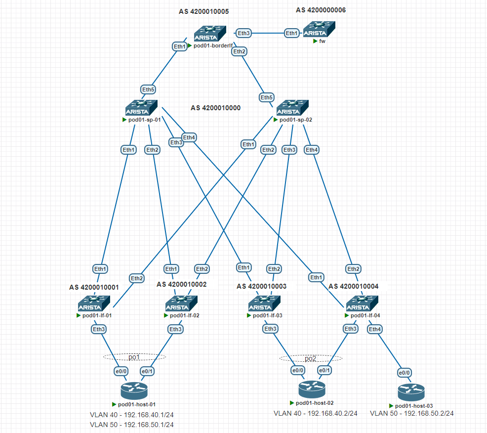

## Цель
- Реализовать передачу суммарных префиксов через EVPN route-type 5
- Настроить взаимодействие между сетями через firewall 
- Настроить взаимодействие между разными vrf в рамках одного leaf в обход firewall

## Схема сети
<details>
<summary>тык</summary>



</details>

## Адресация
[ip plan](./ip_plan.xlsx) 


# Настройка Spine
Настройка UNDERLAY и OVERLAY не изменялась с предыдущего задания

#### Настройка Leaf
На leaf-01/02 будет настроен leaking между vrf clientA(vlan40 192.168.40.254/24) и clientB(vlan50 192.168.50.254/24)

**pod01-lf-01/02**

```
vrf instance clientA
vrf instance clientB

ip routing vrf clientA
ip routing vrf clientB

ip prefix-list LEAKING seq 10 permit 192.168.40.0/24 le 32
ip prefix-list LEAKING seq 20 permit 192.168.50.0/24 le 32

route-map LEAK permit 10
   match ip address prefix-list LEAKING

interface Vlan40
   vrf clientA
   ip address virtual 192.168.40.254/24
!
interface Vlan50
   vrf clientB
   ip address virtual 192.168.50.254/24
     
router bgp 4200010001
 vrf clientA
      rd 10.0.3.1:40
      route-target import evpn 40:40
      route-target import evpn 50:50
      route-target export evpn 40:40
   !
   vrf clientB
      rd 10.0.3.1:50
      route-target import evpn 40:40
      route-target import evpn 50:50
      route-target export evpn 50:50
      
 router general
   vrf clientA
      leak routes source-vrf clientB subscribe-policy LEAK
   !
   vrf clientB
      leak routes source-vrf clientA subscribe-policy LEAK
      
interface Vxlan1
    vxlan vrf clientA vni 40
    vxlan vrf clientB vni 50
```

**pod01-lf-03**

```
vrf instance clientA

ip routing vrf clientA

interface Vlan40
   vrf clientA
   ip address virtual 192.168.40.254/24
   
router bgp 4200010003
 vrf clientA
      rd 10.0.3.3:40
      route-target import evpn 40:40
      route-target export evpn 40:40
      
interface Vxlan1
    vxlan vrf clientA vni 40
```

**pod01-lf-04**

```
vrf instance clientA
vrf instance clientB

ip routing vrf clientA
ip routing vrf clientB

interface Vlan40
   vrf clientA
   ip address virtual 192.168.40.254/24
!
interface Vlan50
   vrf clientB
   ip address virtual 192.168.50.254/24
   
router bgp 4200010004
vrf clientA
      rd 10.0.3.4:40
      route-target import evpn 40:40
      route-target export evpn 40:40
   !
   vrf clientB
      rd 10.0.3.4:50
      route-target import evpn 50:50
      route-target export evpn 50:50
      
interface Vxlan1
   vxlan vrf clientA vni 40
   vxlan vrf clientB vni 50
```

#### Конфигурация эмитации Firewall
```
interface Ethernet1.10
   encapsulation dot1q vlan 10
   ip address 172.0.3.1/31
!
interface Ethernet1.11
   encapsulation dot1q vlan 11
   ip address 172.0.4.1/31
!
interface Loopback0
   ip address 10.0.6.1/32
!
interface Loopback1
   ip address 8.8.8.8/32

!
router bgp 4200000006
   router-id 10.0.6.1
   timers bgp 5 15
   neighbor BR_LF peer group
   neighbor BR_LF remote-as 4200010005
   neighbor BR_LF description borderlf
   neighbor BR_LF password 7 5LkcrMZCcy/XOJae5KiDPA==
   neighbor 172.0.3.0 peer group BR_LF
   neighbor 172.0.4.0 peer group BR_LF
   network 8.8.8.8/32
   aggregate-address 8.0.0.0/8 summary-only
!
end

```

#### Конфигурация Border-leaf
Конфигурация не отличается от остальных leafs за исключением vrf 

```
# Интерфейсы в сторону Firewall 

interface Ethernet3.10
   encapsulation dot1q vlan 10
   vrf clientA
   ip address 172.0.3.0/31
!
interface Ethernet3.11
   encapsulation dot1q vlan 11
   vrf clientB
   ip address 172.0.4.0/31
   
ip prefix-list CLENTS seq 10 permit 192.168.0.0/16 le 32

route-map CLENTS permit 10
   match ip address prefix-list CLENTS
   
router bgp 4200010005
    vrf clientA
          rd 10.0.5.1:40
          route-target import evpn 40:40
          route-target export evpn 40:40
          router-id 10.0.5.1
          neighbor 172.0.3.1 remote-as 4200000006
          neighbor 172.0.3.1 description fw
          neighbor 172.0.3.1 allowas-in 1
          neighbor 172.0.3.1 password 7 m8bSAtIoYtjqqYF7IY3wKA==
          aggregate-address 192.168.40.0/24 summary-only
          redistribute connected route-map CLENTS
       !
       vrf clientB
          rd 10.0.5.1:50
          route-target import evpn 50:50
          route-target export evpn 50:50
          router-id 10.0.5.1
          neighbor 172.0.4.1 remote-as 4200000006
          neighbor 172.0.4.1 description fw
          neighbor 172.0.4.1 allowas-in 1
          neighbor 172.0.4.1 password 7 fvZOoIEPvTXoSDdmZNA+rg==
          aggregate-address 192.168.50.0/24 summary-only
          redistribute connected route-map CLENTS

```

#### Маршруты Type 5(ip-prefix) на LEAF 01 и 04

**pod01-lf-01** sh bgp evpn route-type ip-prefix ipv4
```
Origin codes: i - IGP, e - EGP, ? - incomplete
AS Path Attributes: Or-ID - Originator ID, C-LST - Cluster List, LL Nexthop - Link Local Nexthop

          Network                Next Hop              Metric  LocPref Weight  Path
 * >Ec    RD: 10.0.5.1:40 ip-prefix 8.0.0.0/8
                                 10.0.5.2              -       100     0       4200010000 4200010005 4200000006 i
 *  ec    RD: 10.0.5.1:40 ip-prefix 8.0.0.0/8
                                 10.0.5.2              -       100     0       4200010000 4200010005 4200000006 i
 * >Ec    RD: 10.0.5.1:50 ip-prefix 8.0.0.0/8
                                 10.0.5.2              -       100     0       4200010000 4200010005 4200000006 i
 *  ec    RD: 10.0.5.1:50 ip-prefix 8.0.0.0/8
                                 10.0.5.2              -       100     0       4200010000 4200010005 4200000006 i
 * >Ec    RD: 10.0.5.1:40 ip-prefix 192.168.40.0/24
                                 10.0.5.2              -       100     0       4200010000 4200010005 i
 *  ec    RD: 10.0.5.1:40 ip-prefix 192.168.40.0/24
                                 10.0.5.2              -       100     0       4200010000 4200010005 i
 * >Ec    RD: 10.0.5.1:50 ip-prefix 192.168.40.0/24
                                 10.0.5.2              -       100     0       4200010000 4200010005 4200000006 4200010005 i
 *  ec    RD: 10.0.5.1:50 ip-prefix 192.168.40.0/24
                                 10.0.5.2              -       100     0       4200010000 4200010005 4200000006 4200010005 i
 * >Ec    RD: 10.0.5.1:40 ip-prefix 192.168.50.0/24
                                 10.0.5.2              -       100     0       4200010000 4200010005 4200000006 4200010005 i
 *  ec    RD: 10.0.5.1:40 ip-prefix 192.168.50.0/24
                                 10.0.5.2              -       100     0       4200010000 4200010005 4200000006 4200010005 i
 * >Ec    RD: 10.0.5.1:50 ip-prefix 192.168.50.0/24
                                 10.0.5.2              -       100     0       4200010000 4200010005 i
 *  ec    RD: 10.0.5.1:50 ip-prefix 192.168.50.0/24
                                 10.0.5.2              -       100     0       4200010000 4200010005 i
```

**pod01-lf-04** sh bgp evpn route-type ip-prefix ipv4
```
Origin codes: i - IGP, e - EGP, ? - incomplete
AS Path Attributes: Or-ID - Originator ID, C-LST - Cluster List, LL Nexthop - Link Local Nexthop

          Network                Next Hop              Metric  LocPref Weight  Path
 * >Ec    RD: 10.0.5.1:40 ip-prefix 8.0.0.0/8
                                 10.0.5.2              -       100     0       4200010000 4200010005 4200000006 i
 *  ec    RD: 10.0.5.1:40 ip-prefix 8.0.0.0/8
                                 10.0.5.2              -       100     0       4200010000 4200010005 4200000006 i
 * >Ec    RD: 10.0.5.1:50 ip-prefix 8.0.0.0/8
                                 10.0.5.2              -       100     0       4200010000 4200010005 4200000006 i
 *  ec    RD: 10.0.5.1:50 ip-prefix 8.0.0.0/8
                                 10.0.5.2              -       100     0       4200010000 4200010005 4200000006 i
 * >Ec    RD: 10.0.5.1:40 ip-prefix 192.168.40.0/24
                                 10.0.5.2              -       100     0       4200010000 4200010005 i
 *  ec    RD: 10.0.5.1:40 ip-prefix 192.168.40.0/24
                                 10.0.5.2              -       100     0       4200010000 4200010005 i
 * >Ec    RD: 10.0.5.1:50 ip-prefix 192.168.40.0/24
                                 10.0.5.2              -       100     0       4200010000 4200010005 4200000006 4200010005 i
 *  ec    RD: 10.0.5.1:50 ip-prefix 192.168.40.0/24
                                 10.0.5.2              -       100     0       4200010000 4200010005 4200000006 4200010005 i
 * >Ec    RD: 10.0.5.1:40 ip-prefix 192.168.50.0/24
                                 10.0.5.2              -       100     0       4200010000 4200010005 4200000006 4200010005 i
 *  ec    RD: 10.0.5.1:40 ip-prefix 192.168.50.0/24
                                 10.0.5.2              -       100     0       4200010000 4200010005 4200000006 4200010005 i
 * >Ec    RD: 10.0.5.1:50 ip-prefix 192.168.50.0/24
                                 10.0.5.2              -       100     0       4200010000 4200010005 i
 *  ec    RD: 10.0.5.1:50 ip-prefix 192.168.50.0/24
                                 10.0.5.2              -       100     0       4200010000 4200010005 i
```

#### RIB LEAF 01 и LEAF 04
**pod01-lf-01**

```
#sh ip route vrf clientA

VRF: clientA
Codes: C - connected, S - static, K - kernel,
       O - OSPF, IA - OSPF inter area, E1 - OSPF external type 1,
       E2 - OSPF external type 2, N1 - OSPF NSSA external type 1,
       N2 - OSPF NSSA external type2, B - Other BGP Routes,
       B I - iBGP, B E - eBGP, R - RIP, I L1 - IS-IS level 1,
       I L2 - IS-IS level 2, O3 - OSPFv3, A B - BGP Aggregate,
       A O - OSPF Summary, NG - Nexthop Group Static Route,
       V - VXLAN Control Service, M - Martian,
       DH - DHCP client installed default route,
       DP - Dynamic Policy Route, L - VRF Leaked,
       G  - gRIBI, RC - Route Cache Route

Gateway of last resort is not set

 B E      8.0.0.0/8 [200/0] via VTEP 10.0.5.2 VNI 50 router-mac 50:2c:b8:43:f7:52 local-interface Vxlan1
                            via VTEP 10.0.5.2 VNI 40 router-mac 50:2c:b8:43:f7:52 local-interface Vxlan1
 B E      192.168.40.2/32 [200/0] via VTEP 10.0.4.4 VNI 40 router-mac 50:9e:00:1f:09:51 local-interface Vxlan1
 C        192.168.40.0/24 is directly connected, Vlan40
 B E      192.168.50.2/32 [200/0] via VTEP 10.0.4.4 VNI 50 router-mac 50:9e:00:1f:09:51 local-interface Vxlan1
 C L      192.168.50.0/24 is directly connected (source VRF clientB), Vlan50 (egress VRF clientB)

#sh ip route vrf clientB

VRF: clientB
Codes: C - connected, S - static, K - kernel,
       O - OSPF, IA - OSPF inter area, E1 - OSPF external type 1,
       E2 - OSPF external type 2, N1 - OSPF NSSA external type 1,
       N2 - OSPF NSSA external type2, B - Other BGP Routes,
       B I - iBGP, B E - eBGP, R - RIP, I L1 - IS-IS level 1,
       I L2 - IS-IS level 2, O3 - OSPFv3, A B - BGP Aggregate,
       A O - OSPF Summary, NG - Nexthop Group Static Route,
       V - VXLAN Control Service, M - Martian,
       DH - DHCP client installed default route,
       DP - Dynamic Policy Route, L - VRF Leaked,
       G  - gRIBI, RC - Route Cache Route

Gateway of last resort is not set

 B E      8.0.0.0/8 [200/0] via VTEP 10.0.5.2 VNI 50 router-mac 50:2c:b8:43:f7:52 local-interface Vxlan1
                            via VTEP 10.0.5.2 VNI 40 router-mac 50:2c:b8:43:f7:52 local-interface Vxlan1
 B E      192.168.40.2/32 [200/0] via VTEP 10.0.4.4 VNI 40 router-mac 50:9e:00:1f:09:51 local-interface Vxlan1
 C L      192.168.40.0/24 is directly connected (source VRF clientA), Vlan40 (egress VRF clientA)
 B E      192.168.50.2/32 [200/0] via VTEP 10.0.4.4 VNI 50 router-mac 50:9e:00:1f:09:51 local-interface Vxlan1
 C        192.168.50.0/24 is directly connected, Vlan50

```

**pod01-lf-04**

```
#sh ip rou vrf clientA

VRF: clientA
Codes: C - connected, S - static, K - kernel,
       O - OSPF, IA - OSPF inter area, E1 - OSPF external type 1,
       E2 - OSPF external type 2, N1 - OSPF NSSA external type 1,
       N2 - OSPF NSSA external type2, B - Other BGP Routes,
       B I - iBGP, B E - eBGP, R - RIP, I L1 - IS-IS level 1,
       I L2 - IS-IS level 2, O3 - OSPFv3, A B - BGP Aggregate,
       A O - OSPF Summary, NG - Nexthop Group Static Route,
       V - VXLAN Control Service, M - Martian,
       DH - DHCP client installed default route,
       DP - Dynamic Policy Route, L - VRF Leaked,
       G  - gRIBI, RC - Route Cache Route

Gateway of last resort is not set

 B E      8.0.0.0/8 [200/0] via VTEP 10.0.5.2 VNI 40 router-mac 50:2c:b8:43:f7:52 local-interface Vxlan1
 C        192.168.40.0/24 is directly connected, Vlan40
 B E      192.168.50.0/24 [200/0] via VTEP 10.0.5.2 VNI 40 router-mac 50:2c:b8:43:f7:52 local-interface Vxlan1

#sh ip rou vrf clientB

VRF: clientB
Codes: C - connected, S - static, K - kernel,
       O - OSPF, IA - OSPF inter area, E1 - OSPF external type 1,
       E2 - OSPF external type 2, N1 - OSPF NSSA external type 1,
       N2 - OSPF NSSA external type2, B - Other BGP Routes,
       B I - iBGP, B E - eBGP, R - RIP, I L1 - IS-IS level 1,
       I L2 - IS-IS level 2, O3 - OSPFv3, A B - BGP Aggregate,
       A O - OSPF Summary, NG - Nexthop Group Static Route,
       V - VXLAN Control Service, M - Martian,
       DH - DHCP client installed default route,
       DP - Dynamic Policy Route, L - VRF Leaked,
       G  - gRIBI, RC - Route Cache Route

Gateway of last resort is not set

 B E      8.0.0.0/8 [200/0] via VTEP 10.0.5.2 VNI 50 router-mac 50:2c:b8:43:f7:52 local-interface Vxlan1
 B E      192.168.40.0/24 [200/0] via VTEP 10.0.5.2 VNI 50 router-mac 50:2c:b8:43:f7:52 local-interface Vxlan1
 B E      192.168.50.1/32 [200/0] via VTEP 10.0.4.1 VNI 50 router-mac 50:0a:02:18:8b:dc local-interface Vxlan1
 C        192.168.50.0/24 is directly connected, Vlan50

```
#### Доступность между хостами 

Для данного хоста настроен leaking трафик идет в обход firewall 

**pod01-host-01**
```
interface Vlan40
 vrf forwarding PROD
 ip address 192.168.40.1 255.255.255.0
!
interface Vlan50
 vrf forwarding DEV
 ip address 192.168.50.1 255.255.255.0
 
#sh ip int br
Port-channel1          unassigned      YES unset  up                    up
Vlan40                 192.168.40.1    YES NVRAM  up                    up
Vlan50                 192.168.50.1    YES NVRAM  up                    up


pod01-host-01#ping vrf PROD 192.168.50.2
Type escape sequence to abort.
Sending 5, 100-byte ICMP Echos to 192.168.50.2, timeout is 2 seconds:
!!!!!

pod01-host-01#ping  vrf PROD 192.168.40.2
Type escape sequence to abort.
Sending 5, 100-byte ICMP Echos to 192.168.40.2, timeout is 2 seconds:
!!!!!
Success rate is 100 percent (5/5), round-trip min/avg/max = 17/18/22 ms

pod01-host-01#ping  vrf PROD 192.168.50.1
Type escape sequence to abort.
Sending 5, 100-byte ICMP Echos to 192.168.50.1, timeout is 2 seconds:
!!!!!
Success rate is 100 percent (5/5), round-trip min/avg/max = 4/5/12 ms

pod01-host-01#trace vrf PROD 192.168.50.2
Type escape sequence to abort.
Tracing the route to 192.168.50.2
VRF info: (vrf in name/id, vrf out name/id)
  1 192.168.40.254 2 msec 2 msec 2 msec
  2 192.168.50.254 11 msec 12 msec 11 msec
  3 192.168.50.2 13 msec 13 msec *
```

**pod01-host-02**
```
#sh ip int br
Interface              IP-Address      OK? Method Status                Protocol
Port-channel2          unassigned      YES unset  up                    up
Vlan40                 192.168.40.2    YES manual up                    up

### До vlan 40 host 1, напрямую без firewall vlan 40 растянут 

#ping 192.168.40.1
Type escape sequence to abort.
Sending 5, 100-byte ICMP Echos to 192.168.40.1, timeout is 2 seconds:
!!!!!
Success rate is 100 percent (5/5), round-trip min/avg/max = 9/10/12 ms

#### До vlan 50 host 1, трафик идет через firewall hop 3

pod01-host-02#tra 192.168.50.1
Type escape sequence to abort.
Tracing the route to 192.168.50.1
VRF info: (vrf in name/id, vrf out name/id)
  1 192.168.40.254 2 msec 3 msec 2 msec
  2 172.0.3.0 7 msec 8 msec 6 msec
  3 172.0.3.1 10 msec 9 msec 9 msec
  4 172.0.4.0 11 msec 12 msec 11 msec
  5 192.168.50.254 11 msec 14 msec 13 msec
  6 192.168.50.1 14 msec 15 msec *
  
pod01-host-02#ping  192.168.50.1
Type escape sequence to abort.
Sending 5, 100-byte ICMP Echos to 192.168.50.1, timeout is 2 seconds:
!!!!!
Success rate is 100 percent (5/5), round-trip min/avg/max = 13/13/14 ms

#### До vlan 50 host 3, трафик идет через firewall hop 3

pod01-host-02#ping  192.168.50.2
Type escape sequence to abort.
Sending 5, 100-byte ICMP Echos to 192.168.50.2, timeout is 2 seconds:
!!!!!
Success rate is 100 percent (5/5), round-trip min/avg/max = 17/19/25 ms

pod01-host-02#trac 192.168.50.2
Type escape sequence to abort.
Tracing the route to 192.168.50.2
VRF info: (vrf in name/id, vrf out name/id)
  1 192.168.40.254 2 msec 3 msec 1 msec
  2 172.0.3.0 8 msec 8 msec 7 msec
  3 172.0.3.1 9 msec 14 msec 9 msec
  4 172.0.4.0 11 msec 12 msec 11 msec
  5 192.168.50.254 15 msec 16 msec 18 msec
  6 192.168.50.2 16 msec 18 msec *

```

**pod01-host-03**
```
#sh ip int br
Interface              IP-Address      OK? Method Status                Protocol
Vlan50                 192.168.50.2    YES manual up                    up

#### До vlan 40 host 1, трафик идет через firewall hop 3

pod01-host-03#ping 192.168.40.1
Type escape sequence to abort.
Sending 5, 100-byte ICMP Echos to 192.168.40.1, timeout is 2 seconds:
!!!!!
Success rate is 100 percent (5/5), round-trip min/avg/max = 12/13/16 ms

pod01-host-03#tra 192.168.40.1
Type escape sequence to abort.
Tracing the route to 192.168.40.1
VRF info: (vrf in name/id, vrf out name/id)
  1 192.168.50.254 2 msec 2 msec 2 msec
  2 172.0.4.0 7 msec 7 msec 6 msec
  3 172.0.4.1 9 msec 11 msec 13 msec
  4 172.0.3.0 12 msec 12 msec 11 msec
  5 192.168.40.254 11 msec 11 msec 12 msec
  6 192.168.40.1 13 msec 14 msec *
  
  
#### До vlan 50 host 1, напрямую без firewall vlan 50 растянут 

pod01-host-03#tra 192.168.50.1
Type escape sequence to abort.
Tracing the route to 192.168.50.1
VRF info: (vrf in name/id, vrf out name/id)
  1 192.168.50.1 90 msec 17 msec *
  
pod01-host-03#ping 192.168.50.1
Type escape sequence to abort.
Sending 5, 100-byte ICMP Echos to 192.168.50.1, timeout is 2 seconds:
!!!!!
Success rate is 100 percent (5/5), round-trip min/avg/max = 17/19/23 ms

#### До vlan 40 host 2, через firewall hop 3
pod01-host-03#ping 192.168.40.2
Type escape sequence to abort.
Sending 5, 100-byte ICMP Echos to 192.168.40.2, timeout is 2 seconds:
!!!!!
Success rate is 100 percent (5/5), round-trip min/avg/max = 17/21/30 ms

pod01-host-03#tra 192.168.40.2
Type escape sequence to abort.
Tracing the route to 192.168.40.2
VRF info: (vrf in name/id, vrf out name/id)
  1 192.168.50.254 3 msec 3 msec 1 msec
  2 172.0.4.0 15 msec 12 msec 7 msec
  3 172.0.4.1 13 msec 10 msec 9 msec
  4 172.0.3.0 12 msec 12 msec 12 msec
  5 192.168.40.254 18 msec 16 msec 15 msec
  6 192.168.40.2 17 msec 19 msec *
  
```
### Полный конфиг устройств располагается в папке config