## Цель
- Реализация сетевой фабрики с использованием Overlay технологии VxLAN

## Описание 
- В Underlay используется eBGP
- Межподовое взаимодействие в рамках одного ЦОД
- VxLAN EVPN L3
- BGP пиринг с хостами внутри VRF

## Схема сети

[схема сети](./scheme.drawio)

## Адресация
[ip plan](./ip_plan.xlsx) 


# Настройка UNDERLAY 

## Super Spine

Настраиваем p2p и loopback интерфейсы в сторону Spine, для обоих подов, согласно IP плану и схемы сети

<details>
<summary>dc01-ssp-01</summary>

``` 
interface Ethernet1
   description p2p-to-pod01-sp01
   mtu 9212
   no switchport
   ip address 172.0.1.0/31
!
interface Ethernet2
   description p2p-to-pod01-sp02
   mtu 9212
   no switchport
   ip address 172.0.1.2/31
!
interface Ethernet3
   description p2p-to-pod02-sp01
   mtu 9212
   no switchport
   ip address 172.0.1.4/31
!
interface Ethernet4
   description p2p-to-pod02-sp02
   mtu 9212
   no switchport
   ip address 172.0.1.6/31
   
interface Loopback0
   ip address 10.0.0.250/32
```
</details>

<details>
<summary>dc01-ssp-02</summary>

``` 
interface Ethernet1
   description p2p-to-pod02-sp-01
   mtu 9212
   no switchport
   ip address 172.0.2.4/31
!
interface Ethernet2
   description p2p-to-pod02-sp-02
   mtu 9212
   no switchport
   ip address 172.0.2.6/31
!
interface Ethernet3
   description p2p-to-pod01-sp-01
   mtu 9212
   no switchport
   ip address 172.0.2.0/31
!
interface Ethernet4
   description p2p-to-pod01-sp-02
   mtu 9212
   no switchport
   ip address 172.0.2.2/31

interface Loopback0
   ip address 10.0.0.251/32
``` 
</details>

Создаем префикс листы и route-map, на обоих ssp

``` 
ip prefix-list LOOPBACKS seq 10 permit 10.0.0.0/24 le 32

!
route-map LOOPBACKS permit 10
   match ip address prefix-list LOOPBACKS
!
route-map POD_PX permit 20
   match ip address prefix-list LOOPBACKS

!
peer-filter AS_FILTER
   10 match as-range 4201020000-4201020062 result accept
   20 match as-range 4201010000-4201010062 result accept
```

Настройка eBGP

<details>
<summary>dc01-ssp-01</summary>

``` 
router bgp 4201000000
   router-id 10.0.0.250
   timers bgp 5 15
   maximum-paths 2
   
   bgp listen range 172.0.1.0/26 peer-group SP_UNDERLAY peer-filter AS_FILTER
   
   neighbor SP_UNDERLAY peer group
   neighbor SP_UNDERLAY route-map POD_PX out
   neighbor SP_UNDERLAY password 7 vsD+HkqwiPzR55yWmhS9uQ==
   
   redistribute connected route-map LOOPBACKS

```
</details>

<details>
<summary>dc01-ssp-02</summary>

```
router bgp 4201000000
   router-id 10.0.0.251
   timers bgp 5 15
   maximum-paths 2

   bgp listen range 172.0.2.0/26 peer-group SP_UNDERLAY peer-filter AS_FILTER

   neighbor SP_UNDERLAY peer group
   neighbor SP_UNDERLAY route-map POD_PX out
   neighbor SP_UNDERLAY password 7 vsD+HkqwiPzR55yWmhS9uQ==
   redistribute connected route-map LOOPBACKS

```
</details>


## Spine

На обоих spine настраиваем p2p и loopback интерфейсы в сторону Super Spine, Leaf согласно IP плану и схемы сети

Пример приведен, для разных подов, на одном spine из пары

<details>
<summary>pod01-sp-01</summary>

```

interface Ethernet1
   description p2p_to_lf01
   mtu 9212
   no switchport
   ip address 172.1.1.0/31
!
interface Ethernet2
   description p2p_to_lf02
   mtu 9212
   no switchport
   ip address 172.1.1.2/31
!
interface Ethernet3
   description p2p_to_ssp01
   mtu 9212
   no switchport
   ip address 172.0.1.1/31
!
interface Ethernet4
   description p2p_to_ssp02
   mtu 9212
   no switchport
   ip address 172.0.2.1/31
   
interface Loopback0
   ip address 10.1.0.250/32
```
</details>

<details>
<summary>pod02-sp-01</summary>

```
interface Ethernet1
   description p2p-to-pod02-lf-01
   mtu 9212
   no switchport
   ip address 172.2.1.0/31
!
interface Ethernet2
   description p2p-to-pod02-lf-02
   mtu 9212
   no switchport
   ip address 172.2.1.2/31
!
interface Ethernet3
   description p2p-to-dc01-ssp-02
   mtu 9212
   no switchport
   ip address 172.0.2.5/31
!
interface Ethernet4
   description p2p-to-dc01-ssp-01
   mtu 9212
   no switchport
   ip address 172.0.1.5/31
   
interface Loopback0
   ip address 10.2.0.250/32

```
</details>

- Создаем префикс листы и route-map, на обоих spine
- Настраиваем BGP

<details>
<summary>pod01-sp-01</summary>

```
ip prefix-list LOOPBACKS seq 10 permit 10.1.0.0/24 le 32
!
route-map LOOPBACKS permit 10
   match ip address prefix-list LOOPBACKS
!
peer-filter AS_FILTER
   10 match as-range 4201010001-4201010062 result accept
!
router bgp 4201010000
   router-id 10.1.0.250
   timers bgp 5 15
   maximum-paths 2
   bgp listen range 172.1.1.0/25 peer-group LF_UNDERLAY peer-filter AS_FILTER
   neighbor LF_UNDERLAY peer group
   neighbor LF_UNDERLAY password 7 MfA8KHrQWc19gzI6EW4TNg==
   neighbor UNDERLAY peer group
   neighbor UNDERLAY remote-as 4201000000
   neighbor UNDERLAY password 7 jmpdyRSxiVBvFvR7P2BPvg==
   neighbor 172.0.1.0 peer group UNDERLAY
   neighbor 172.0.2.0 peer group UNDERLAY
   redistribute connected route-map LOOPBACKS

```
</details>

<details>
<summary>pod02-sp-01</summary>

```
ip prefix-list LOOPBACKS seq 10 permit 10.2.0.0/24 le 32
!
route-map LOOPBACKS permit 10
   match ip address prefix-list LOOPBACKS
!
peer-filter AS_FILTER
   10 match as-range 4201020001-4201020062 result accept
!
router bgp 4201020000
   router-id 10.2.0.250
   timers bgp 5 15
   maximum-paths 2
   bgp listen range 172.2.1.0/25 peer-group LF_UNDERLAY peer-filter AS_FILTER
   neighbor LF_UNDERLAY peer group
   neighbor LF_UNDERLAY password 7 MfA8KHrQWc19gzI6EW4TNg==
   neighbor UNDERLAY peer group
   neighbor UNDERLAY remote-as 4201000000
   neighbor UNDERLAY password 7 jmpdyRSxiVBvFvR7P2BPvg==
   neighbor 172.0.1.4 peer group UNDERLAY
   neighbor 172.0.2.4 peer group UNDERLAY
   redistribute connected route-map LOOPBACKS


```
</details>


## Leaf

На обоих leaf настраиваем p2p и loopback интерфейсы в сторону Spine, согласно IP плану и схемы сети

Пример приведен, для разных подов, на одном leaf из пары

<details>
<summary>pod01-lf-01</summary>

```
interface Ethernet1
   description p2p_to_sp01
   mtu 9212
   no switchport
   ip address 172.1.1.1/31
!
interface Ethernet2
   description p2p_to_sp02
   mtu 9212
   no switchport
   ip address 172.1.2.1/31
   
interface Loopback0
   ip address 10.1.0.1/32
```
</details>

<details>
<summary>pod02-lf-01</summary>

```
interface Ethernet1
   description p2p-to-sp01
   mtu 9212
   no switchport
   ip address 172.2.1.1/31
!
interface Ethernet2
   description p2p-to-sp02
   mtu 9212
   no switchport
   ip address 172.2.2.1/31

interface Loopback0
   ip address 10.2.0.1/32

```
</details>

- Создаем префикс листы и route-map, на обоих leaf
- Настраиваем BGP

<details>
<summary>pod01-lf-01</summary>

```
ip prefix-list LOOPBACKS seq 10 permit 10.1.0.0/24 le 32

route-map LOOPBACKS permit 10
   match ip address prefix-list LOOPBACKS

router bgp 4201010001
   router-id 10.1.0.1
   timers bgp 5 15
   maximum-paths 2
   neighbor SP_UNDERLAY peer group
   neighbor SP_UNDERLAY remote-as 4201010000
   neighbor SP_UNDERLAY password 7 vsD+HkqwiPzR55yWmhS9uQ==

   neighbor 172.1.1.0 peer group SP_UNDERLAY
   neighbor 172.1.2.0 peer group SP_UNDERLAY
   redistribute connected route-map LOOPBACKS

```
</details>

<details>
<summary>pod02-lf-01</summary>

```
ip prefix-list LOOPBACKS seq 10 permit 10.2.0.0/24 le 32
!
route-map LOOPBACKS permit 10
   match ip address prefix-list LOOPBACKS
!
router bgp 4201020001
   router-id 10.2.0.1
   timers bgp 5 15
   maximum-paths 2
   neighbor SP_UNDERLAY peer group
   neighbor SP_UNDERLAY remote-as 4201020000
   neighbor SP_UNDERLAY password 7 vsD+HkqwiPzR55yWmhS9uQ==

   neighbor 172.2.1.0 peer group SP_UNDERLAY
   neighbor 172.2.2.0 peer group SP_UNDERLAY
   redistribute connected route-map LOOPBACKS
```
</details>


## Проверка связоности по UNDERLAY

Super spine со всеми spine 
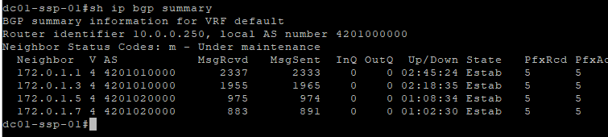

Spine
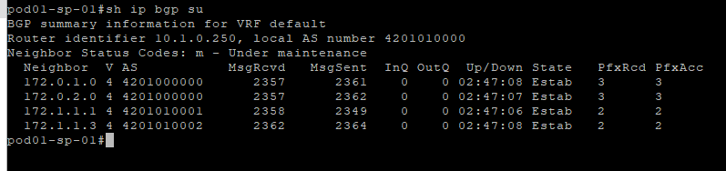

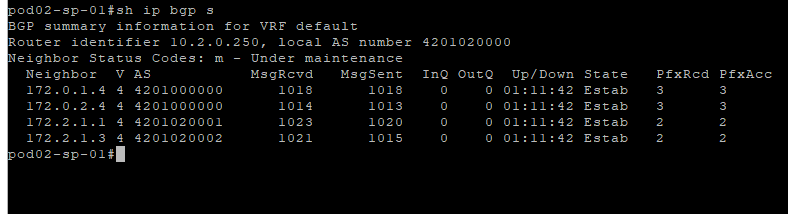

LEAF
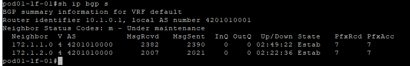

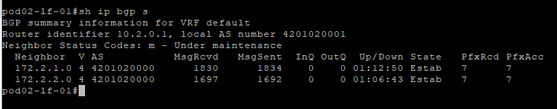


# Настройка Overlay


## Super Spine

К существующей конфигурации для UNDERLAY добавляем новую, для OVERLAY 

Создаем префикс листы и route-map, на обоих ssp, чтоб только нужные префиксы перетикали между подами

``` 
ip prefix-list OVERLAY_LOOPBACKS seq 20 permit 10.254.0.0/16 le 32

!
route-map POD_PX permit 30
   match ip address prefix-list OVERLAY_LOOPBACKS
```

Настройка eBGP

``` 
router bgp 4201000000
   bgp listen range 10.1.0.0/25 peer-group LF_OVERLAY peer-filter AS_FILTER
   bgp listen range 10.2.0.0/25 peer-group LF_OVERLAY peer-filter AS_FILTER
   
   neighbor LF_OVERLAY peer group
   neighbor LF_OVERLAY update-source Loopback0
   neighbor LF_OVERLAY ebgp-multihop 2
   neighbor LF_OVERLAY password 7 PJF2jC5W/bZVMrBToHX0sA==
   neighbor LF_OVERLAY send-community
   
   address-family evpn
      neighbor LF_OVERLAY activate
   !
   address-family ipv4
      no neighbor LF_OVERLAY activate

```


На dc01-ssp-01 анологичные настройки 


## Leaf
К существующей конфигурации для UNDERLAY добавляем новую, для OVERLAY 

Создаем префикс лист для lo1 под overlay 

**pod01-lf-01**

``` 
interface Loopback1
   ip address 10.254.1.1/32
   
ip prefix-list LOOPBACKS seq 20 permit 10.254.1.0/25 le 32

```

Настройка eBGP

``` 
router bgp 4201010001
   neighbor SSP_OVERLAY peer group
   neighbor SSP_OVERLAY remote-as 4201000000
   neighbor SSP_OVERLAY update-source Loopback0
   neighbor SSP_OVERLAY ebgp-multihop 2
   neighbor SSP_OVERLAY password 7 TNJF2j6ngsK7fyctq5tj2w==
   neighbor SSP_OVERLAY send-community
   neighbor 10.0.0.250 peer group SSP_OVERLAY
   neighbor 10.0.0.251 peer group SSP_OVERLAY

   !
   address-family evpn
      neighbor SSP_OVERLAY activate
   !
   address-family ipv4
      no neighbor SSP_OVERLAY activate

```

На всех leaf анологичные настройки за исключение lo1 адресация согласна IP плану 


## Проверка связоности по OVERLAY

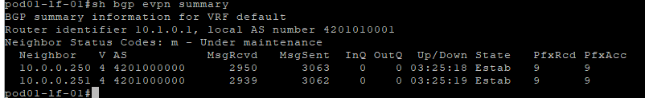


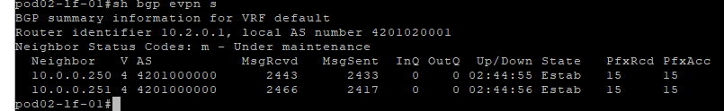


# Настройка L3VPN и необходимые настройки для хостов

Настройки интерфейсов в сторону хоста

в pod01 хост будет подключен через lag с использованием EVPN Active/Active

**pod01-lf-01**

```
vlan 40
vrf instance A
ip routing vrf A

interface Ethernet3
   description pod01-host-01
   channel-group 1 mode active
   no shutdown

interface Port-Channel1
   switchport trunk allowed vlan 40
   switchport mode trunk
   !
   evpn ethernet-segment
      identifier 0000:0000:0001:0001:0000
      route-target import 00:00:00:01:00:01
   lacp system-id 0000.0001.0001
   
interface Vlan40
   vrf A
   ip address 192.168.40.2/29
```

Настройки BGP

```
router bgp 4201010001
vlan 40
      rd 10.1.0.1:10040
      route-target both 1:10040
      redistribute learned
vrf A
      rd 10.1.0.1:1
      route-target import evpn 1:10101
      route-target export evpn 1:10101
      neighbor 192.168.40.1 remote-as 65001
      neighbor 192.168.40.1 password 7 Pdm6JYUBn6Nsvk5ze74SvA==

```
Настройка VTEP

```
interface Vxlan1
   vxlan source-interface Loopback1
   vxlan udp-port 4789
   vxlan vlan 40 vni 10040
   vxlan vrf A vni 10101
```

**pod01-lf-02** 


```
interface Vlan40
   vrf A
   ip address 192.168.40.3/29
   
router bgp 4201010001
vlan 40
      rd 10.1.0.2:10040
      route-target both 1:10040
      redistribute learned
vrf A
      rd 10.1.0.2:1
      route-target import evpn 1:10101
      route-target export evpn 1:10101
      neighbor 192.168.40.1 remote-as 65001
      neighbor 192.168.40.1 password 7 Pdm6JYUBn6Nsvk5ze74SvA==

```

остальные настройки анологичны **pod01-lf-01**


**pod02-lf-01**

в pod02 хост будет подключен без использования lag 
Настройки интерфейсов в сторону хоста

```
vlan 40
vrf instance A
ip routing vrf A

interface Ethernet3
   description pod02-host-01
   switchport trunk allowed vlan 40
   switchport mode trunk
   no shutdown
   
interface Vlan40
   vrf A
   ip address 192.168.40.6/30
```

Настройки BGP

```
router bgp 4201010001

vrf A
      rd 10.2.0.1:1
      route-target import evpn 1:10101
      route-target export evpn 1:10101
      neighbor 192.168.40.5 remote-as 65002
      neighbor 192.168.40.5 password 7 TpAoFj60w2+Vs/kDELyYFQ==

```
Настройка VTEP

```
interface Vxlan1
   vxlan source-interface Loopback1
   vxlan udp-port 4789
   vxlan vrf A vni 10101
```


**pod02-lf-02**

```
vlan 50
vrf instance A
ip routing vrf A

interface Ethernet3
   description pod02-host-01
   switchport trunk allowed vlan 50
   switchport mode trunk
   no shutdown
   
interface Vlan50
   vrf A
   ip address 192.168.50.6/30
```

Настройки BGP

```
router bgp 4201010001

vrf A
      rd 10.2.0.2:1
      route-target import evpn 1:10101
      route-target export evpn 1:10101
      neighbor 192.168.50.5 remote-as 65002
      neighbor 192.168.50.5 password 7 TpAoFj60w2+Vs/kDELyYFQ==

```
Настройка VTEP

```
interface Vxlan1
   vxlan source-interface Loopback1
   vxlan udp-port 4789
   vxlan vrf A vni 10101
```


## Проверка связоности по L3VPN

POD01
**pod01-lf-01**
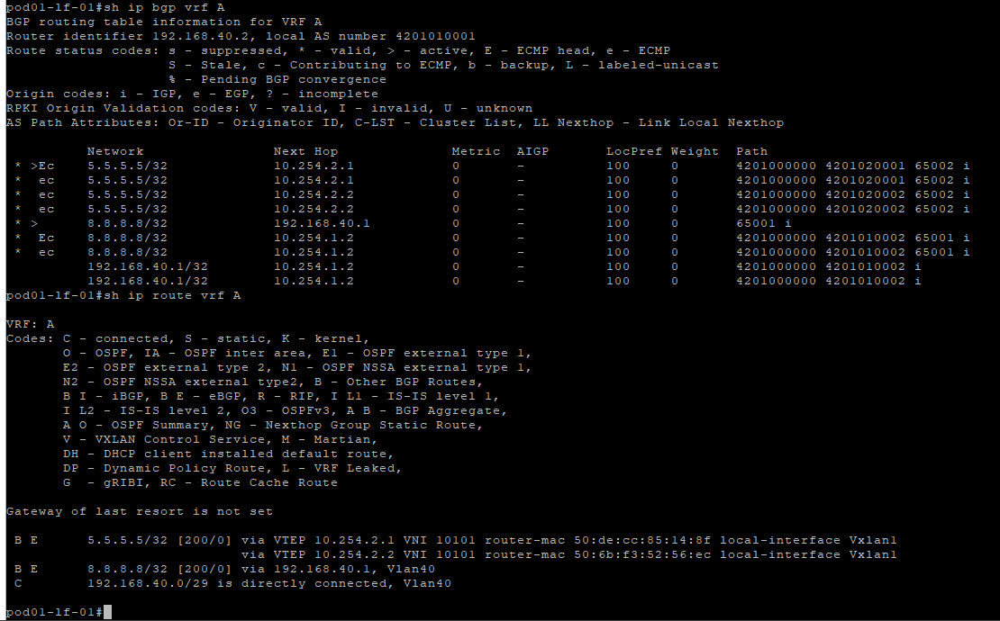

**pod01-host-01**
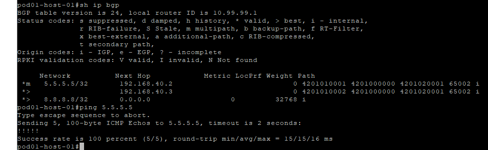

POD02

**pod02-lf-01**

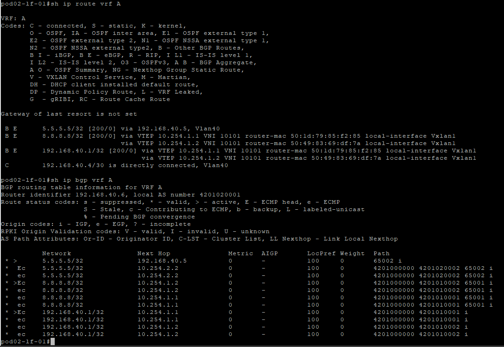

**pod02-host-01**
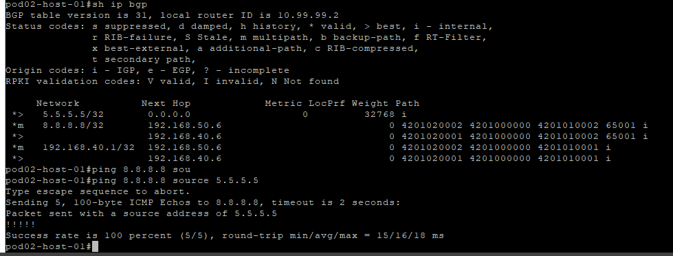


### Полный конфиг устройств располагается в папке config